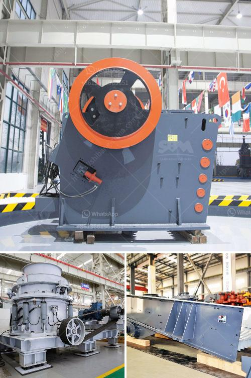

<h3>crusher price in oman</h3>
Oman, a country located in the southeast of the Arabian Peninsula, is known for its strategic location and bustling economy. The construction sector in Oman has been growing rapidly due to the government's focus on infrastructure development and urbanization. As a result, there has been an increased demand for various construction materials, including crushers.

Crushers are heavy-duty machines used to break large rocks into smaller stones or gravel for construction purposes. They are widely used in mining, metallurgy, construction, and other industries. With the growing demand for crushers in Oman, it is essential to understand the factors that influence their prices in the market.

One of the primary factors affecting crusher prices in Oman is the type of crusher. There are different types of crushers available in the market, including jaw crushers, cone crushers, impact crushers, and gyratory crushers. Each type of crusher has its own specifications, features, and uses. Therefore, their prices vary based on their capabilities and performance.

Another crucial factor that determines crusher prices in Oman is the brand. The market is flooded with numerous crusher brands, both local and international. Well-established and renowned brands usually have higher prices due to their reputation for quality and reliability.

The size and capacity of the crusher also play a significant role in determining its price. Crushers with larger feed openings and higher output capacities tend to be more expensive than those with smaller sizes. This is because larger crushers require more materials and advanced engineering designs, which increase their manufacturing costs.

In addition to the type, brand, size, and capacity, the availability of spare parts also affects crusher prices in Oman. It is crucial to choose a crusher that has readily available spare parts in the local market. Crushers with scarce or expensive spare parts may necessitate longer downtimes and higher maintenance costs, making them less attractive to potential buyers.

Furthermore, the overall condition and age of the crusher can influence its price. Used crushers are often available at lower prices than new ones. However, the condition and maintenance history of the used crusher should be thoroughly inspected to ensure its reliability and operational efficiency.

Additionally, factors such as transportation and installation costs should be considered when determining the total crusher price in Oman. Shipping large and heavy crushers to Oman can add significant expenses to the overall cost. Similarly, the costs associated with installation, setup, and commissioning should be accounted for during the purchasing process.

To find the best crusher price in Oman, it is recommended to conduct thorough market research and compare prices from different suppliers. Online platforms, local dealers, and construction equipment exhibitions can be valuable sources of information and provide a comprehensive understanding of the prevailing crusher prices in Oman's market.

In conclusion, the price of crushers in Oman is governed by various factors, including the type, brand, size, capacity, spare parts availability, condition, and additional costs. Prospective buyers should carefully assess their requirements and budget constraints before making a purchase decision. By considering these factors and conducting thorough market research, one can find a crusher that meets their needs at a competitive price in Oman.
<h3>Contact us</h3><ul><li><strong>Whatsapp:&nbsp;<a href="https://wa.me/8613661969651">+8613661969651</a></strong></li><li><a href="https://swt.shibang-china.com/?git&amp;zhl&amp;crusher price in oman"><strong>Online Service(chat now)</strong></a></li></ul><h3>Related</h3><ul><li><a href='rock gypsum buyers in china.md'>rock gypsum buyers in china</a></li><li><a href='jaw crusher crusher china.md'>jaw crusher crusher china</a></li><li><a href='gold production process flow chart.md'>gold production process flow chart</a></li><li><a href='harga stone cruser bekas dijual.md'>harga stone cruser bekas dijual</a></li><li><a href='machinery needed for limestone extraction.md'>machinery needed for limestone extraction</a></li></ul>