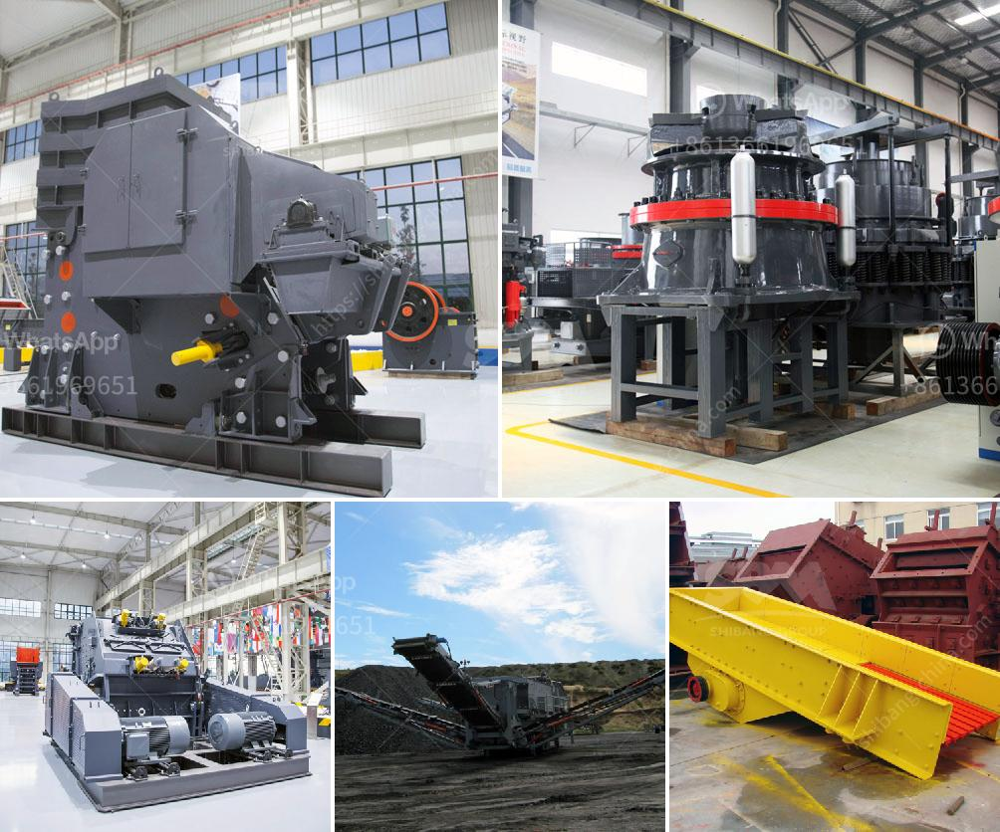

<h3>crusher price south africa</h3>
South Africa is known for its diverse wealth of minerals, but even more so for its irresistible allure to tourists. From the historic cities to the stunning landscapes, South Africa is a gem to be savored. However, the country is also home to various industrial and engineering marvels. One such example is the crushing machine, which has revolutionized the mining sector. This article delves into the topic of crusher price in South Africa, exploring the factors that influence the overall cost.

First and foremost, one must understand that the crusher price is not indicative of the quality or efficiency of the machine. Crushers come in various sizes and types, each designed for different purposes. Some crushers are more suitable for mining, while others are designed for recycling applications. Therefore, the price will significantly vary depending on the specific requirements of the buyer.

Furthermore, the price will also be influenced by the brand and reputation of the manufacturer. Renowned brands are often associated with high-quality products and state-of-the-art technology. As a result, they may charge a premium for their crushers. On the other hand, lesser-known manufacturers may offer more competitive prices to establish their presence in the market.

Moreover, the South African market is highly competitive, which further affects the crusher price. Manufacturers try to outdo each other by offering attractive prices and additional features. As a result, buyers can often find crushers at discounted rates or with added benefits such as extended warranties or after-sales service.

Additionally, the type and capacity of the crusher will also have a significant impact on its price. Some crushers are designed for smaller-scale operations, while others are meant for large-scale mining or construction projects. Naturally, larger and more powerful crushers will command a higher price due to their increased production capacity.

The availability and cost of raw materials used in the manufacturing process are additional factors that influence crusher prices. South Africa is rich in mineral resources, which makes obtaining materials relatively easier and less expensive. However, fluctuations in the global commodity market can cause the prices of raw materials to surge or decline, ultimately impacting the final price of the crusher.

Lastly, economic factors such as inflation and exchange rates play a crucial role in determining crusher prices in South Africa. Inflation can drive up the cost of production and transportation, increasing the overall price of the crusher. Exchange rates can also impact prices, especially if the crusher is imported or if its components are sourced from abroad.

In conclusion, when considering the price of crushers in South Africa, it is essential to consider various factors. These include the type and capacity of the crusher, the brand reputation, market competition, availability and cost of raw materials, and economic factors. Careful evaluation of these elements will enable buyers to make informed decisions and find the best value for their money. Ultimately, investing in a crusher that meets their specific needs and budget will contribute to the overall success of their ventures in South Africa's thriving mining and construction industry.
<h3>Contact us</h3><ul><li><strong>Whatsapp:&nbsp;<a href="https://wa.me/8613661969651">+8613661969651</a></strong></li><li><a href="https://swt.shibang-china.com/?git&amp;zhl&amp;crusher price south africa"><strong>Online Service(chat now)</strong></a></li></ul><h3>Related</h3><ul><li><a href='all model vsi crusher.md'>all model vsi crusher</a></li><li><a href='jaw crusher in uzbekistan.md'>jaw crusher in uzbekistan</a></li><li><a href='processing of copper crusher.md'>processing of copper crusher</a></li><li><a href='used portable crushing plant for sale.md'>used portable crushing plant for sale</a></li><li><a href='suppliers kenya crusher.md'>suppliers kenya crusher</a></li></ul>