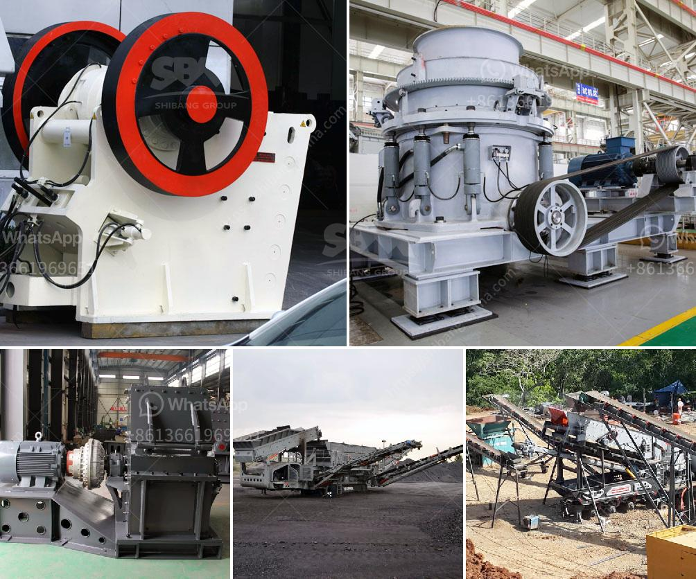

<h3>crusher price zenith</h3>
Crusher price is an important factor in deciding the purchasing power of customers. As a leading manufacturer of mining equipment, Zenith offers a wide range of crushers for various applications. The diverse selection of crushers ensures every customer can find their desired machine at a competitive price.

Zenith understands the needs of different customers and strives to provide them with the best value for their investment. With years of experience in the industry, Zenith has developed an efficient manufacturing process that not only ensures high-quality products but also allows for cost-effective production. This enables Zenith to offer competitive prices for its crushers without compromising on quality.

The crusher price from Zenith varies depending on the specific model and features of the machine. Different types of crushers have different production capacities, and customers can choose the suitable crusher according to their requirements. Whether it is a jaw crusher, impact crusher, cone crusher, or gyratory crusher, Zenith has a wide range of options to meet different needs.

In addition to the model, the price of a crusher also depends on other factors such as the production capacity, power consumption, and maintenance requirements. Zenith's crushers are designed to be efficient and low-maintenance, reducing operational costs for customers. This makes the overall cost of owning and operating a crusher more affordable.

Customers can also benefit from Zenith's after-sales service, which includes technical support, spare parts supply, and regular maintenance. Zenith has a global network of service centers and trained technicians to ensure that customers receive prompt assistance whenever needed. This comprehensive support system adds value to the crusher purchase and helps customers maximize their investment.

Another advantage of purchasing a crusher from Zenith is the company's commitment to sustainable development. Zenith integrates environmental considerations into its manufacturing processes and products, aiming to minimize the environmental impact. By choosing a crusher from Zenith, customers can contribute to a greener future while enjoying the benefits of a high-quality and affordable machine.

In conclusion, the crusher price from Zenith offers customers excellent value for their money. The company's commitment to quality, efficiency, and customer satisfaction ensures that customers get the best possible crusher at a competitive price. With a wide range of models and features to choose from, Zenith caters to the varying needs of different customers. Moreover, the comprehensive after-sales service and commitment to sustainability make Zenith a trustworthy choice for anyone in need of a crusher.
<h3>Contact us</h3><ul><li><strong>Whatsapp:&nbsp;<a href="https://wa.me/8613661969651">+8613661969651</a></strong></li><li><a href="https://swt.shibang-china.com/?git&amp;zhl&amp;crusher price zenith"><strong>Online Service(chat now)</strong></a></li></ul><h3>Related</h3><ul><li><a href='different crushed stones in nigeria.md'>different crushed stones in nigeria</a></li><li><a href='rotary kiln design calculation pdf.md'>rotary kiln design calculation pdf</a></li><li><a href='salt crusher machine pakistan.md'>salt crusher machine pakistan</a></li><li><a href='limestone crushing machine supplier.md'>limestone crushing machine supplier</a></li><li><a href='vertical roller mill manufacturers.md'>vertical roller mill manufacturers</a></li></ul>