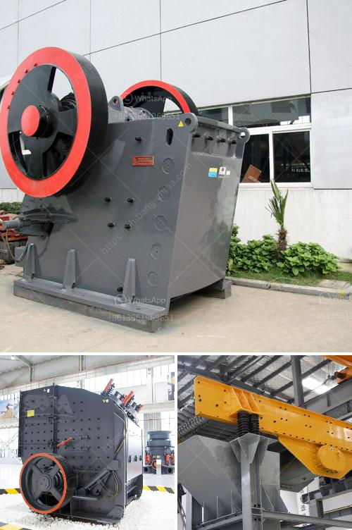

<h3>crusher prices stone crusher primary and secondary</h3>
When it comes to crushing equipment, there are two distinct categories of crushers that are used globally – Primary and Secondary crushers. Primary crushers are heavy-duty machines used to reduce large rocks into smaller rocks, gravel, or rock dust, while secondary crushers are used to further refine smaller rocks into the desired aggregate size. Both types of crushers play a crucial role in the mining and construction industry.

The price of a crusher is an important factor to consider when investing in crushing equipment. It is essential to understand the different factors that influence crusher prices to ensure that you make a well-informed decision.

Primary crushers are typically more expensive than secondary crushers due to their larger size and higher capacity. These crushers are designed to handle large feed sizes and process high volumes of material efficiently. The cost of primary crushers can vary depending on factors such as the type of rock being crushed, capacity requirements, and the manufacturer. Generally, primary crushers have a starting price range from $50,000 to $100,000.

Secondary crushers, on the other hand, are generally smaller in size and have a lower capacity compared to primary crushers. These crushers are typically used after the primary crushing stage to further reduce the size of the rocks. Secondary crushers are often used in the construction industry to produce concrete aggregate and road base materials. The price of secondary crushers can vary based on factors such as the size of the machine, the desired output size, and the manufacturer. Generally, secondary crushers have a starting price range from $30,000 to $50,000.

In addition to the size and capacity, other factors also affect crusher prices. These include the quality and durability of the machine, the type of technology used, and the level of automation. High-quality crushers made from robust materials tend to have a higher price due to the longevity and performance they offer. Crushers that incorporate advanced technologies and automation features may also come with a higher price tag but provide added benefits such as improved efficiency, reduced maintenance, and increased productivity.

It is important to note that crusher prices can also vary geographically. Factors such as import/export costs, taxes, and local market demand can influence the final price of the equipment. Additionally, prices may fluctuate over time due to changes in raw material costs, manufacturing processes, and economic factors.

Before investing in a crusher, it is crucial to conduct thorough research and compare different options to find the best value for your specific needs. Consider factors such as the required capacity, desired output size, and any additional features or specifications that are important to your application. Consulting with industry experts and obtaining multiple quotes from reputable suppliers can help you make an informed decision while ensuring that you get the best possible price.

In conclusion, the prices of primary and secondary crushers vary based on numerous factors including size, capacity, quality, technology, and location. Careful consideration of these factors is crucial when making an investment in crushing equipment to ensure that you select the right machine at the best price to meet your specific requirements.
<h3>Contact us</h3><ul><li><strong>Whatsapp:&nbsp;<a href="https://wa.me/8613661969651">+8613661969651</a></strong></li><li><a href="https://swt.shibang-china.com/?git&amp;zhl&amp;crusher prices stone crusher primary and secondary"><strong>Online Service(chat now)</strong></a></li></ul><h3>Related</h3><ul><li><a href='mobil rock pulverizer.md'>mobil rock pulverizer</a></li><li><a href='new hammer mill pricing.md'>new hammer mill pricing</a></li><li><a href='turkish association marble machinery.md'>turkish association marble machinery</a></li><li><a href='old cement plant in india for sale.md'>old cement plant in india for sale</a></li><li><a href='ball mill grinders cost.md'>ball mill grinders cost</a></li></ul>