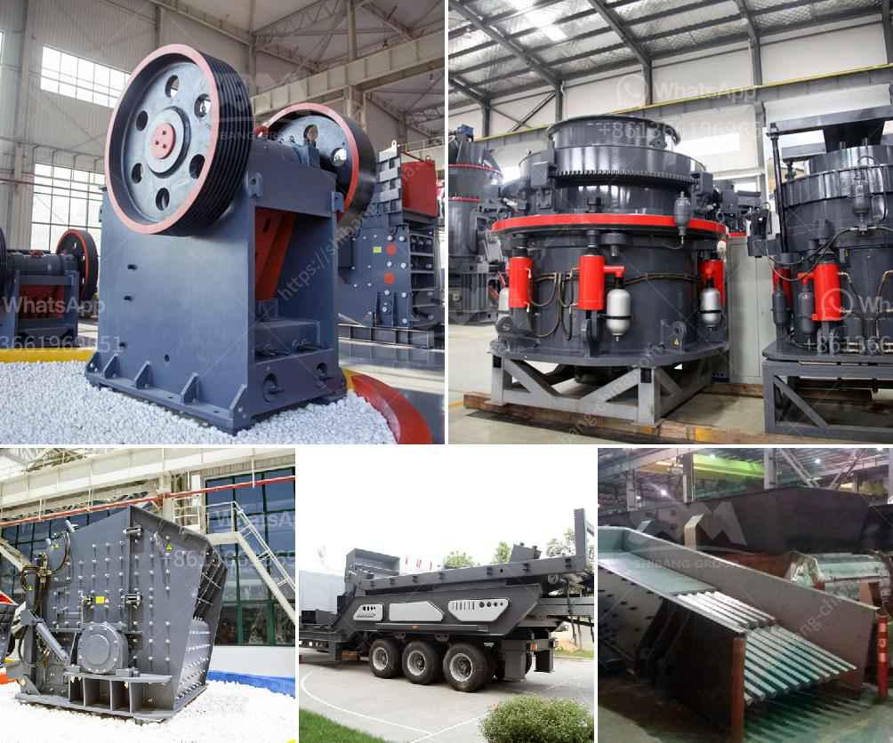

<h3>crusher primary cone crusher</h3>
The primary cone crusher is a critical piece of equipment in the construction and mining industry. It is used to break down large rocks into smaller pieces, making it easier to transport and work with. In the past, primary crushers were considered secondary processing machines, but with advancements in technology and increased demand for aggregates, primary cone crushers have become more efficient and versatile.

One of the main advantages of using a primary cone crusher is the ability to produce a narrow particle size distribution. This is essential for the quality control of many construction materials, including concrete and asphalt. By breaking down rocks into smaller, uniform sizes, primary cone crushers ensure that every particle meets the required specifications, resulting in a better end product.

In terms of performance, primary cone crushers have evolved over the years to handle more demanding applications. They are designed to handle large feed sizes, making them suitable for primary crushing operations. With the capability to process hard and abrasive materials, primary cone crushers are often used in mining operations to crush ore and extract valuable minerals.

Another advantage of primary cone crushers is their ability to work in conjunction with other crushing equipment. This allows for efficient processing of different types of materials, reducing overall production time and costs. For example, primary cone crushers can be used to pre-crush rock before it is fed into a secondary crusher, improving the efficiency and performance of the entire crushing circuit.

Maintenance and longevity are also important factors to consider when choosing a primary cone crusher. These machines are built to withstand heavy-duty use and are often subjected to harsh operating conditions. To ensure optimal performance, regular maintenance and routine inspections are necessary. With proper care, primary cone crushers can have a long service life, contributing to a cost-effective and reliable crushing solution.

In summary, the primary cone crusher is an essential piece of equipment in the construction and mining industry. Its ability to break down large rocks into smaller, uniform sizes ensures the production of high-quality materials. Its versatility and compatibility with other crushing equipment make it a valuable asset in the crushing circuit. To maximize its performance and longevity, regular maintenance and inspections are necessary. Overall, primary cone crushers offer an efficient and reliable solution for processing a wide range of materials in various industries.
<h3>Contact us</h3><ul><li><strong>Whatsapp:&nbsp;<a href="https://wa.me/8613661969651">+8613661969651</a></strong></li><li><a href="https://swt.shibang-china.com/?git&amp;zhl&amp;crusher primary cone crusher"><strong>Online Service(chat now)</strong></a></li></ul><h3>Related</h3><ul><li><a href='complete stone crushering plant shanghai.md'>complete stone crushering plant shanghai</a></li><li><a href='vibrating classifiing screen.md'>vibrating classifiing screen</a></li><li><a href='gold processing ball mills in india china.md'>gold processing ball mills in india china</a></li><li><a href='ball mills nigeria.md'>ball mills nigeria</a></li><li><a href='vibratory screen south africa.md'>vibratory screen south africa</a></li></ul>