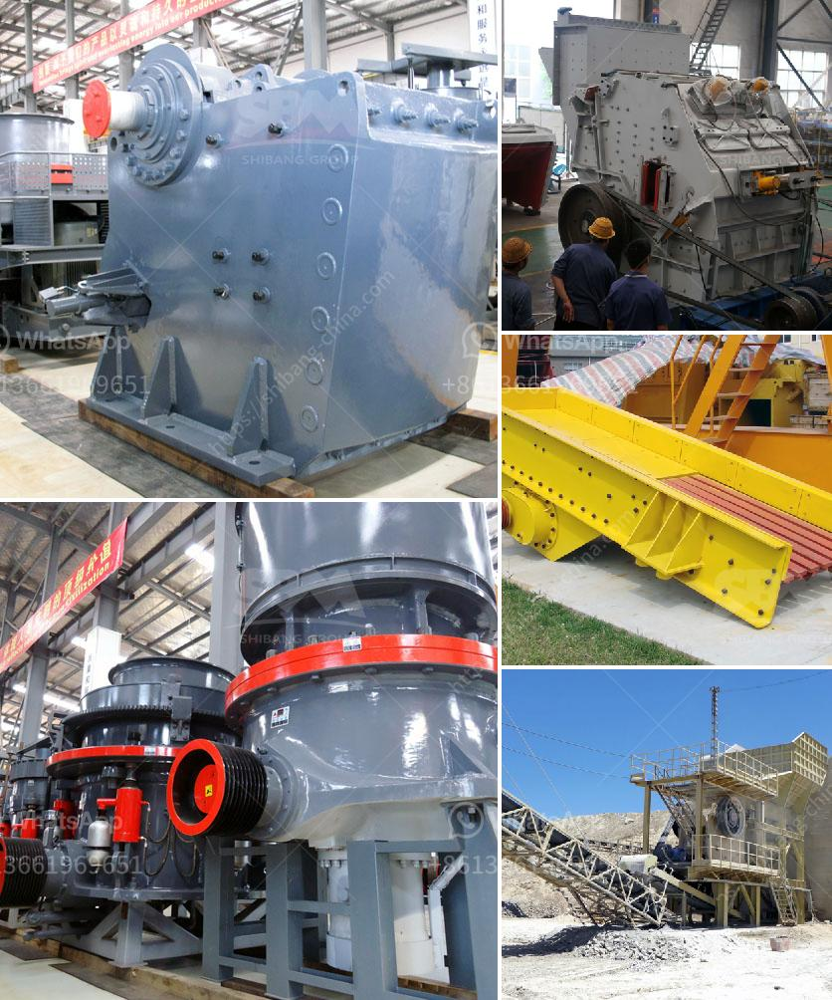

<h3>crusher size 1 ton capacity hour</h3>
Crushers are machines designed to reduce the size of various materials such as rocks, gravel, or minerals. They are commonly used in the mining, construction, and recycling industries to break down materials into smaller sizes for further processing. One important factor to consider when choosing a crusher is its capacity.

A crusher's capacity is typically measured in tons per hour. This refers to the amount of material it can crush in one hour. A crusher with a capacity of 1 ton per hour means that it can crush 1 ton of material in an hour. In a typical quarry scenario, this can translate into a higher production rate and increased profitability.

The size of the crusher also plays a vital role in determining its capacity. Crushers come in different sizes, ranging from small handheld models to larger industrial machines. When it comes to a crusher with a 1-ton capacity, the specific size is not mentioned. However, it is safe to assume that it would be smaller than larger capacity crushers.

Smaller crushers are suitable for smaller operations or situations where the need for crushing is not as frequent or intensive. For instance, a small-scale quarry or construction site may require a crusher with a 1-ton capacity to process materials sporadically. On the other hand, larger capacity crushers are more suitable for operations that require continuous crushing, such as large-scale mining operations.

Ultimately, the choice of crusher size and capacity depends on the specific requirements of the operation. Factors such as the type of material being crushed, the desired end product size, and the available budget all play a role in determining the appropriate crusher size.

In conclusion, a crusher with a 1-ton capacity per hour can be a valuable asset for various industries. It allows for efficient processing of materials, resulting in increased productivity and profitability. However, it is crucial to consider other factors such as the specific size and requirements of the operation when choosing the right crusher.
<h3>Contact us</h3><ul><li><strong>Whatsapp:&nbsp;<a href="https://wa.me/8613661969651">+8613661969651</a></strong></li><li><a href="https://swt.shibang-china.com/?git&amp;zhl&amp;crusher size 1 ton capacity hour"><strong>Online Service(chat now)</strong></a></li></ul><h3>Related</h3><ul><li><a href='industrial rock crusher.md'>industrial rock crusher</a></li><li><a href='denver roll crusher for sale.md'>denver roll crusher for sale</a></li><li><a href='quarry crusher in nigeria.md'>quarry crusher in nigeria</a></li><li><a href='maintenance plan of crusher.md'>maintenance plan of crusher</a></li><li><a href='crushers for phonolite.md'>crushers for phonolite</a></li></ul>