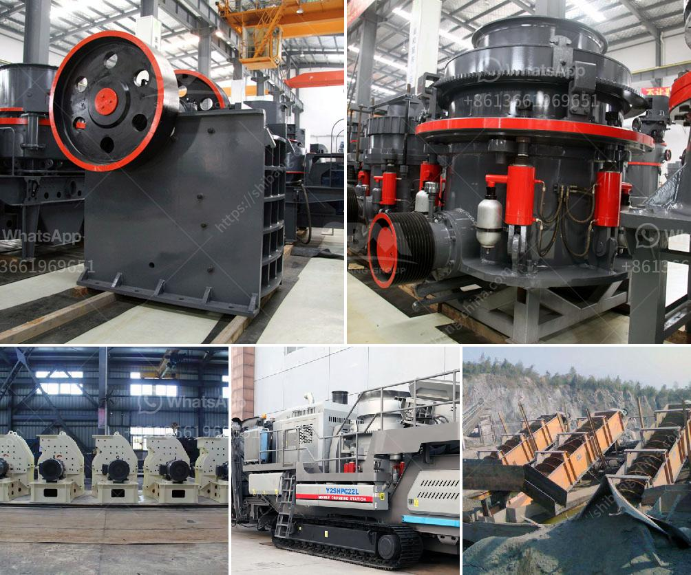

<h3>crusher specification</h3>
Crushers play a significant role in different industries such as mining and construction. Therefore, understanding the specifications of a crusher is important for choosing the right one for the job. In this article, we will discuss crusher specifications in detail.

Crushers are machines designed to reduce the size of large rocks, stones, or ores into smaller pieces. They are used in a variety of industries for crushing materials into specific sizes or shapes. The specifications of a crusher give information about the maximum feed size, capacity, motor power, and other important factors that should be considered when buying a crusher.

One of the most crucial specifications to consider is the maximum feed size. This refers to the size of the material that the crusher can handle. It is important to know the maximum feed size because feeding larger rocks or materials into the crusher may result in damage or failure of the machine. Therefore, it is essential to ensure that the feed size does not exceed the crusher's maximum capacity.

The capacity of a crusher is another critical specification to consider. It refers to the amount of material the crusher can process within a specific time frame. The capacity is usually measured in metric tons per hour or short tons per hour. Understanding the required capacity is crucial to ensure that the crusher can meet the production demands of the industry.

Motor power is another important specification to consider when choosing a crusher. It determines the energy required to crush the material effectively. Motor power is typically measured in kilowatts (kW) or horsepower (HP). Higher motor power ensures efficient crushing and reduces the chances of the crusher getting overloaded.

The crusher's discharge setting is a specification that determines the final product size. It refers to the distance between the fixed and moving jaw plates or the concave and mantle surfaces. The discharge setting can be adjusted to produce different sizes of crushed materials.

Apart from these primary specifications, there are other important factors to consider when buying a crusher. The type of crusher, such as jaw crushers, gyratory crushers, cone crushers, or impact crushers, should be selected based on the specific application and material properties.

Related to the type of crusher is the liner material. The liners are used to protect the crusher's mainframe from wear and tear during crushing. Depending on the material being crushed, different liner materials are used to maximize the crusher's lifespan.

It is also important to consider the maintenance requirements of the crusher. Regular maintenance and servicing are crucial to keep the crusher in optimal condition. Some crushers require more frequent maintenance than others, and the ease of access for maintenance tasks should be considered.

In conclusion, understanding crusher specifications is essential for choosing the right crusher for a specific industry or application. Specifications such as maximum feed size, capacity, motor power, and discharge setting should be carefully considered. Additionally, factors such as the type of crusher, liner material, and maintenance requirements also play a significant role. By taking all these factors into account, businesses can make informed decisions when selecting a crusher that meets their needs.
<h3>Contact us</h3><ul><li><strong>Whatsapp:&nbsp;<a href="https://wa.me/8613661969651">+8613661969651</a></strong></li><li><a href="https://swt.shibang-china.com/?git&amp;zhl&amp;crusher specification"><strong>Online Service(chat now)</strong></a></li></ul><h3>Related</h3><ul><li><a href='limestone crushing.md'>limestone crushing</a></li><li><a href='bauxite crushing processing equipments.md'>bauxite crushing processing equipments</a></li><li><a href='gypsum beneficiation process.md'>gypsum beneficiation process</a></li><li><a href='bentonite plant system.md'>bentonite plant system</a></li><li><a href='crushing machine from china.md'>crushing machine from china</a></li></ul>