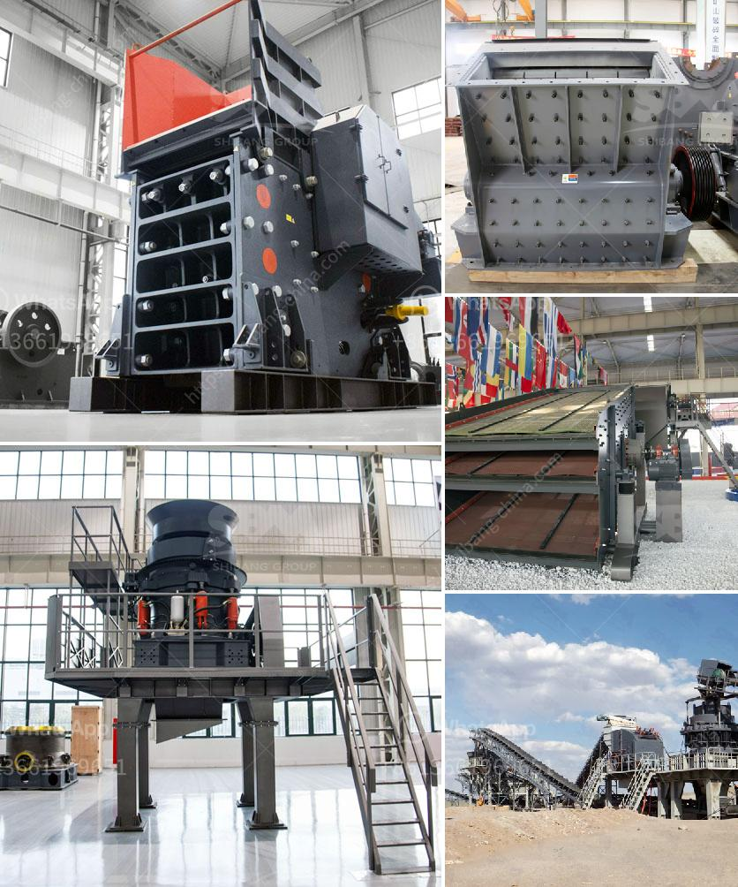

<h3>crusher stone manufacturers</h3>
Crusher Stone Manufacturers: Delivering Superior Products for a Varied Range of Construction Applications

Crushed stones are an essential component in the construction industry. They are used as a base material in building foundations, roads, and railways, and serve as an excellent drainage solution. With the growing demand for high-quality crushed stones, crusher stone manufacturers are playing a significant role in meeting the needs of builders and contractors.

Crusher stone manufacturers extract various types of raw materials from quarries. These extracted materials are then transformed into stone products such as gravel, crushed rock, and sand. These products are used in a variety of construction projects, from laying roads to reinforcing concrete structures.

One of the main reasons why crushed stones are widely used in construction is its durability. Due to the crushing process, these stones have rough edges that interlock with each other, providing excellent load-bearing capacity. This makes it ideal for supporting heavy structures and preventing soil erosion.

Crusher stone manufacturers offer a wide range of stone products that are suitable for different construction applications. Here are some of the most commonly used products:

1. Gabion Stones: These stones are used in gabion walls, which are often used for erosion control and slope stabilization. Gabion walls are constructed by filling wire cages with stacked stones. The interlocking nature of these stones creates a stable structure that can withstand heavy loads.

2. Concrete Aggregates: Crusher stone manufacturers produce a fine aggregate known as concrete sand, which is commonly used in the production of ready-mix concrete. This sand has sharp edges that interlock with each other, allowing for a stronger concrete mix.

3. Road Base: Crushed stones are used as a sub-base material in road construction. The stones provide stability and strength to the road surface, preventing cracks and potholes from forming. They also aid in proper drainage, ensuring that water does not accumulate on the road surface.

4. Railway Ballast: Crusher stone manufacturers produce high-quality stones that are used as railway ballast. These stones act as support for the railway tracks, preventing them from moving or shifting. The stones must be strong enough to withstand the weight and impact of trains passing over them.

When selecting a crusher stone manufacturer, it is crucial to consider quality and reliability. Reputable manufacturers adhere to strict quality control standards to ensure that their products meet industry specifications. They invest in modern equipment and technologies to extract, crush, and process stones efficiently. Additionally, they employ skilled personnel who are knowledgeable about different types of stones and their specific applications.

In conclusion, crusher stone manufacturers play a vital role in the construction industry by providing high-quality crushed stones for a wide range of applications. From building foundations to road and railway construction, their products are essential in ensuring the durability and stability of structures. By choosing a reliable manufacturer, builders and contractors can access superior products that are engineered to meet industry standards.
<h3>Contact us</h3><ul><li><strong>Whatsapp:&nbsp;<a href="https://wa.me/8613661969651">+8613661969651</a></strong></li><li><a href="https://swt.shibang-china.com/?git&amp;zhl&amp;crusher stone manufacturers"><strong>Online Service(chat now)</strong></a></li></ul><h3>Related</h3><ul><li><a href='mobile stone crushing machine in america.md'>mobile stone crushing machine in america</a></li><li><a href='gypsum mining in garissa.md'>gypsum mining in garissa</a></li><li><a href='feldspar crusher for sale.md'>feldspar crusher for sale</a></li><li><a href='gypsum beneficiation process.md'>gypsum beneficiation process</a></li><li><a href='simple stone crushers kenya.md'>simple stone crushers kenya</a></li></ul>