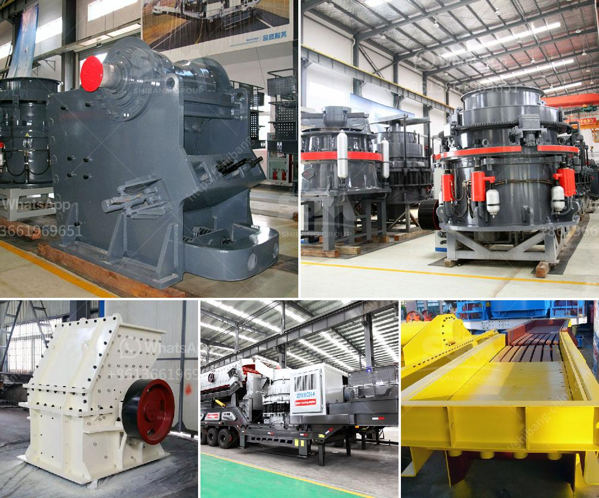

<h3>crusher stone prices peru</h3>
Peru, known for its rich cultural heritage and archaeological wonders, also boasts a thriving construction industry. From towering skyscrapers to cozy homes, Peru's infrastructure continues to grow at an impressive rate. And at the heart of this construction boom lies a crucial element - crusher stones.

Crusher stones, also known as aggregates, are an essential ingredient in the production of concrete and asphalt. These crushed stones are primarily used to provide strength and durability to construction projects of various sizes. As such, understanding the pricing of crusher stones in Peru becomes crucial for contractors and homeowners alike.

The price of crusher stones in Peru can be influenced by several factors. One of the primary determinants is the size and quality of the stone. Generally, crusher stones are available in different sizes ranging from dust to larger stones used for road construction. The quality of the stone, including its hardness and composition, can also affect the pricing.

Another factor that impacts crusher stone prices is the location. Peru, being a vast country, possesses diverse geological characteristics. Some regions might have an abundance of suitable stones, while others might rely on importing materials from neighboring areas. Transportation costs, therefore, contribute to the final price of crusher stones, which can vary depending on the distance traveled.

Furthermore, the demand and supply dynamics within Peru's construction industry also play a significant role in determining crusher stone prices. During periods of intense construction activity, the demand for crusher stones surges, resulting in higher prices. Conversely, when the demand decreases, prices may soften. Economic conditions, government infrastructure projects, and population growth can all impact demand and supply levels, influencing the overall pricing trends.

It is also worth noting that crusher stones can be sourced from both natural and artificial sources. Natural stones, such as granite, limestone, or basalt, require mining and extraction processes. The environmental impact and availability of these natural stones can influence their prices. On the other hand, artificial stones, made from recycled materials, can offer more cost-effective alternatives.

In Peru, the average price for crusher stones ranges from $30 to $70 per ton, depending on various factors. For instance, smaller stones used for residential projects might be priced lower, while larger stones reserved for commercial or industrial construction could command a premium. These prices are subject to change, as market conditions and other factors fluctuate over time.

Crusher stones are readily available in Peru from various suppliers and quarries. Local market research and contacting different suppliers can provide valuable insights into the prevailing prices in specific regions. It is advisable for contractors and homeowners to compare prices and quality before making a purchase decision, as the ultimate goal is to achieve the best balance between cost and durability.

In conclusion, understanding crusher stone prices in Peru is essential for the successful execution of construction projects. Several factors, such as stone size, quality, location, demand and supply dynamics, and sourcing methods, contribute to the final price. By considering these factors, contractors and homeowners can make informed decisions and ensure the longevity and strength of their construction projects.
<h3>Contact us</h3><ul><li><strong>Whatsapp:&nbsp;<a href="https://wa.me/8613661969651">+8613661969651</a></strong></li><li><a href="https://swt.shibang-china.com/?git&amp;zhl&amp;crusher stone prices peru"><strong>Online Service(chat now)</strong></a></li></ul><h3>Related</h3><ul><li><a href='ball mills in coimbatore.md'>ball mills in coimbatore</a></li><li><a href='vibrating screen capacity calculation.md'>vibrating screen capacity calculation</a></li><li><a href='cone crusher msp300.md'>cone crusher msp300</a></li><li><a href='hammer mills for stone.md'>hammer mills for stone</a></li><li><a href='ballast crusher plant.md'>ballast crusher plant</a></li></ul>