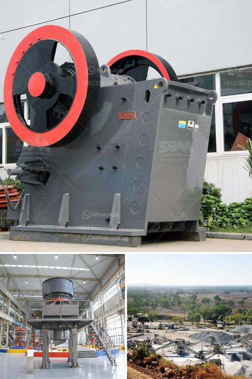

<h3>crusher supplier china</h3>
China has become a prominent supplier of various types of crushing equipment in the global market. After decades of development, the country has successfully built a complete industrial chain that covers different aspects of the crushing process. As a result, crusher suppliers from China have gained recognition and popularity worldwide.

One of the key advantages of Chinese crusher suppliers is their focus on research and development. These suppliers are constantly investing in technological advancements to improve the performance, efficiency, and reliability of their products. They strive to design and manufacture crushers that cater to the specific needs and requirements of their customers.

China is known for its vast manufacturing capabilities, and crusher suppliers take full advantage of this. They have access to state-of-the-art manufacturing facilities, enabling them to produce high-quality equipment at competitive prices. This makes Chinese crushers a cost-effective option for businesses in need of crushing machinery.

Moreover, crusher suppliers in China offer a wide range of equipment to serve different industries. Whether it is mining, construction, or recycling, there is a crusher available for every application. From jaw crushers to cone crushers, from impact crushers to mobile crushers, there is a crusher suitable for every stage of the crushing process.

In addition to a diverse range of products, Chinese crusher suppliers also provide excellent after-sales service. They ensure that their customers receive timely assistance and support whenever needed. This commitment to customer satisfaction has earned China a reputation of reliability and trustworthiness in the crushing industry.

Crusher suppliers from China have transformed the crushing industry with their high-quality equipment, technological advancements, and exceptional customer service. They have successfully positioned themselves as leaders in the global market by continuously meeting the evolving needs of their customers. As the demand for crushing equipment continues to grow, Chinese suppliers are poised to serve the industry with even more innovative and reliable solutions.
<h3>Contact us</h3><ul><li><strong>Whatsapp:&nbsp;<a href="https://wa.me/8613661969651">+8613661969651</a></strong></li><li><a href="https://swt.shibang-china.com/?git&amp;zhl&amp;crusher supplier china"><strong>Online Service(chat now)</strong></a></li></ul><h3>Related</h3><ul><li><a href='process flow diagram for kaolin calcining using kiln.md'>process flow diagram for kaolin calcining using kiln</a></li><li><a href='crusher size 1 ton capacity hour.md'>crusher size 1 ton capacity hour</a></li><li><a href='hammer mill design drawing pdf.md'>hammer mill design drawing pdf</a></li><li><a href='how to control partials size in vertical hammer mill.md'>how to control partials size in vertical hammer mill</a></li><li><a href='crusher stone prices peru.md'>crusher stone prices peru</a></li></ul>