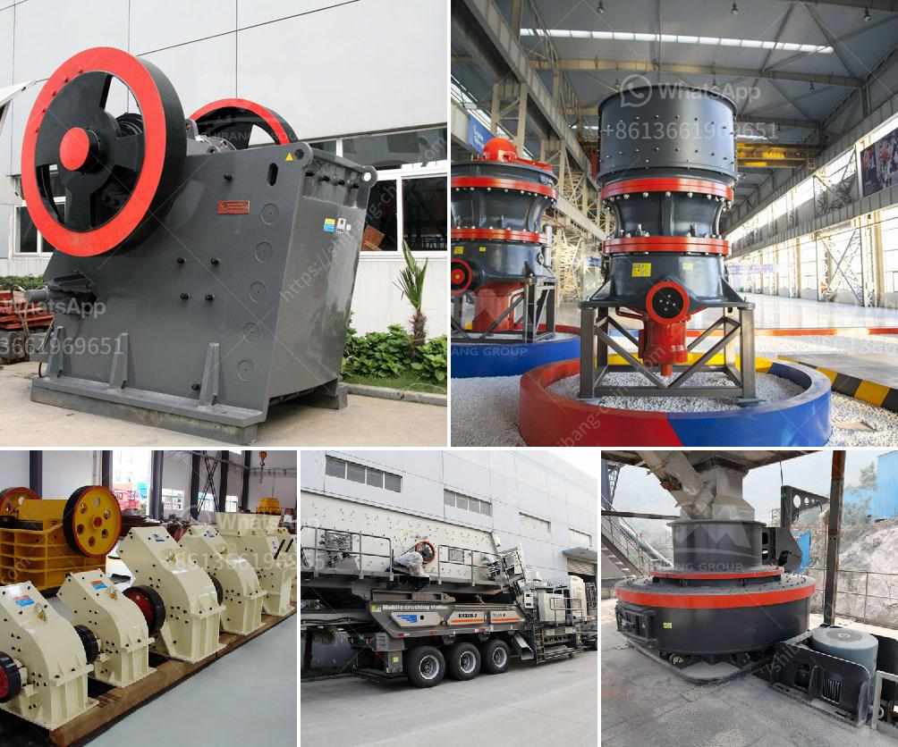

<h3>crusher supplier in china</h3>
With the rapid development of the construction industry, the demand for stone crushers is also increasing in China. As a leading crusher supplier in China, SBM has been providing quality and efficient crushers to global customers for decades.

As one of the professional crusher suppliers in China, SBM has a team of experienced and skilled engineers who are dedicated to designing, manufacturing, and delivering quality crushers to clients all around the world. With advanced technology and high-quality materials, SBM's crushers are built to withstand the toughest conditions and deliver reliable performance.

One of the key advantages of choosing SBM as your crusher supplier is the variety of crushing equipment they offer. From jaw crushers to cone crushers and impact crushers, SBM can provide the right solution for your specific needs. Whether you need a single crusher or a complete crushing plant, SBM's crushers are designed to maximize productivity and minimize operating costs.

In addition to providing quality crushers, SBM also offers a comprehensive range of services to support their customers. These services include installation, commissioning, training, and after-sales service. From the moment you contact SBM, their team of experts will guide you through the entire process and provide solutions to any problems or challenges you may encounter.

Another advantage of choosing SBM as your crusher supplier is their commitment to continuous innovation and improvement. SBM invests heavily in research and development to ensure that their crushers are at the forefront of technology. This dedication to innovation allows SBM to offer state-of-the-art crushers that are more efficient, durable, and environmentally friendly.

SBM's commitment to quality extends to their manufacturing process as well. They have strict quality control measures in place to ensure that every crusher that leaves their factory meets the highest standards. This attention to detail and commitment to quality make SBM a reliable and trustworthy crusher supplier in China.

In conclusion, if you are looking for a crusher supplier in China, SBM is a great choice. With a wide range of crushers and a commitment to quality and innovation, SBM can provide the right crusher for your construction needs. Their team of experienced engineers and comprehensive range of services ensure a smooth and hassle-free buying experience. Trust in SBM as your crusher supplier and experience the difference in performance and reliability.
<h3>Contact us</h3><ul><li><strong>Whatsapp:&nbsp;<a href="https://wa.me/8613661969651">+8613661969651</a></strong></li><li><a href="https://swt.shibang-china.com/?git&amp;zhl&amp;crusher supplier in china"><strong>Online Service(chat now)</strong></a></li></ul><h3>Related</h3><ul><li><a href='crushing and screening plant rental.md'>crushing and screening plant rental</a></li><li><a href='grinding mill for corundum.md'>grinding mill for corundum</a></li><li><a href='jaw crushers for sale in zimbabwe.md'>jaw crushers for sale in zimbabwe</a></li><li><a href='gold refining machine capacity 2 tons per day.md'>gold refining machine capacity 2 tons per day</a></li><li><a href='mobile crusher hire in uae.md'>mobile crusher hire in uae</a></li></ul>