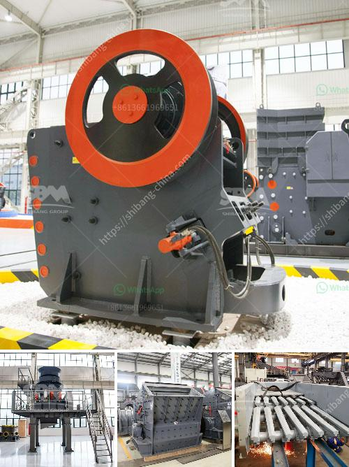

<h3>crusher unit and quarry land for sale</h3>
Are you searching for a promising investment opportunity that guarantees a consistent return? Look no further! A crusher unit and quarry land situated in a prime location are now available for sale. With exceptional lucrative prospects, this investment promises to be a profitable venture for potential buyers.

This crusher unit and quarry land offer an outstanding opportunity for entrepreneurs intending to start their own business or expand an existing one. The property encompasses a fully functional crusher unit with state-of-the-art machinery capable of producing high-quality aggregates. Additionally, it boasts vast land perfectly suited for quarrying activities, ensuring a continuous and abundant supply of raw materials.

The crusher unit and quarry are strategically situated in an area with a high demand for construction materials. The property is conveniently accessible from major transportation networks, which simplifies distribution to nearby cities, construction sites, and infrastructure development projects. In such a prime location, the potential for profit is significant and ever-present.

The crusher unit is equipped with top-notch machinery, meticulously selected to maximize productivity and efficiency. It includes crushers, screening equipment, conveyors, and loaders, all in excellent working condition. This ensures seamless operations and allows for a smooth production process, meeting the demands of various construction projects.

One of the most valuable aspects of this investment is the abundant availability of raw materials. The quarry land boasts substantial reserves of high-quality aggregates, ensuring a stable production capacity with the potential for expansion. The steady supply of aggregates is essential for meeting the growing demands of the construction industry.

The construction industry is thriving globally, with ever-increasing demands for infrastructure development, urbanization, and housing projects. As a result, demand for construction materials such as aggregates is consistently high, creating a great opportunity for the crusher unit and quarry land to become a profitable and sustainable business.

With the high demand for aggregates and the property's prime location, investors can expect substantial revenue from the sale of materials to construction companies and contractors. Moreover, as construction projects continue to multiply, the potential for expansion and increasing profitability becomes even more significant, making this investment an attractive venture.

In conclusion, the availability of a crusher unit and quarry land presents a fantastic opportunity for individuals or companies seeking a solid investment with great potential for returns. The combination of a fully operational crusher unit, abundant reserves of high-quality aggregates, and an ideal location make this investment a lucrative one. Embracing this venture affords investors the opportunity to capitalize on the thriving construction industry, secure a steady revenue stream, and contribute to the growth of local infrastructure development.

Act now and seize this exceptional opportunity to invest in the crusher unit and quarry land. With promising prospects and the potential for substantial financial gains, this investment will undoubtedly yield long-term benefits.
<h3>Contact us</h3><ul><li><strong>Whatsapp:&nbsp;<a href="https://wa.me/8613661969651">+8613661969651</a></strong></li><li><a href="https://swt.shibang-china.com/?git&amp;zhl&amp;crusher unit and quarry land for sale"><strong>Online Service(chat now)</strong></a></li></ul><h3>Related</h3><ul><li><a href='kaolin processing plant.md'>kaolin processing plant</a></li><li><a href='rock gypsum buyers in china.md'>rock gypsum buyers in china</a></li><li><a href='turkish supplier for phosphate ball mill.md'>turkish supplier for phosphate ball mill</a></li><li><a href='used gold washing machines.md'>used gold washing machines</a></li><li><a href='mobil rock pulverizer.md'>mobil rock pulverizer</a></li></ul>