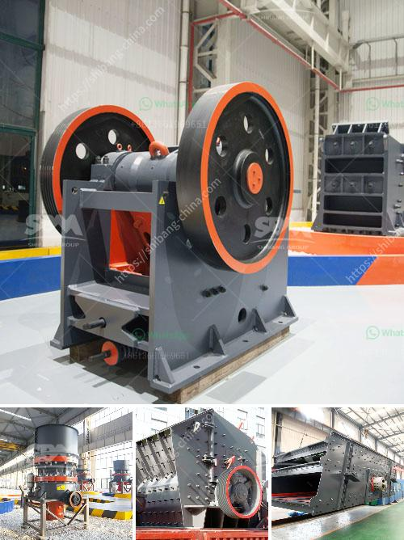

<h3>crushers for phonolite</h3>
Phonolite, a volcanic rock commonly found in regions with recent volcanic activity, is gaining attention in the construction industry for its unique properties. With its fine-grained composition and durability, phonolite is being used for various applications such as road construction, concrete production, and landscaping. However, to utilize this rock efficiently, reliable crushers designed specifically for phonolite are needed.

One such crusher is the jaw crusher, a machine commonly used in the mining and quarrying industry. Its strong and durable nature makes it suitable for processing phonolite rocks. The jaw crusher uses compression to break down the rock into smaller pieces, reducing it to a manageable size for further processing. The adjustable settings on the jaw crusher allow for precise control over the final product size, ensuring uniformity and consistency.

Another type of crusher commonly used for phonolite is the cone crusher. This crusher operates by squeezing the rock between an eccentrically gyrating spindle and a concave mantle. The cone crusher's ability to handle abrasive and hard rocks makes it a popular choice in phonolite processing. Its efficient crushing action results in a high reduction ratio, producing a well-graded final product.

For larger-scale operations, impact crushers are often employed. These crushers use the principle of rapid impact to shatter the phonolite rocks. The high-speed rotation of the rotor generates strong forces, crushing the rock and breaking it into small fragments. The impact crusher's versatility allows for precise control over the final product size, making it suitable for various construction applications.

Choosing the right crusher for phonolite processing is crucial to maximize productivity and ensure high-quality output. Factors such as the rock's hardness, feed size, and desired product size should be considered when selecting the appropriate crusher. Additionally, regular maintenance and proper installation are essential to ensure consistent performance and prolong the crusher's lifespan.

In conclusion, crushers designed specifically for phonolite offer a solution to efficiently process this volcanic rock for construction purposes. Whether it's the jaw crusher, cone crusher, or impact crusher, these machines are capable of breaking down phonolite into smaller, manageable sizes. With their durability and versatile performance, crushers for phonolite are breaking boundaries in material processing, providing a valuable resource for the construction industry.
<h3>Contact us</h3><ul><li><strong>Whatsapp:&nbsp;<a href="https://wa.me/8613661969651">+8613661969651</a></strong></li><li><a href="https://swt.shibang-china.com/?git&amp;zhl&amp;crushers for phonolite"><strong>Online Service(chat now)</strong></a></li></ul><h3>Related</h3><ul><li><a href='crusher equipment price.md'>crusher equipment price</a></li><li><a href='iron ore crushed machine second hand.md'>iron ore crushed machine second hand</a></li><li><a href='crushing plant in calatagan batangas.md'>crushing plant in calatagan batangas</a></li><li><a href='china quarry crushing production line equipment.md'>china quarry crushing production line equipment</a></li><li><a href='gravel crusher for sale.md'>gravel crusher for sale</a></li></ul>