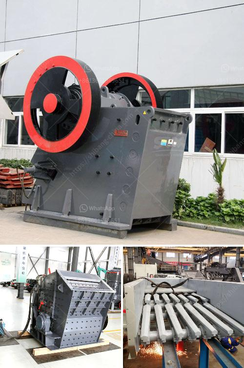

<h3>crushers made in south philippines</h3>
The South Philippines has seen a remarkable surge in economic development over the past few decades. As industries expand and demand for raw materials and construction materials grows, the need for efficient machines to crush and process these materials becomes paramount. Thankfully, the region is not short on innovation, with several crushers made in the South Philippines standing out as reliable, cost-effective, and high-quality solutions.

Crushers, commonly referred to as crushing machines, are integral components in various industries such as mining, construction, and recycling, among others. They are used to break down large rocks, stones, and other raw materials into smaller, manageable sizes. These smaller particles are then used in the production of concrete, asphalt, and other building materials, or as feedstock for other industrial processes.

One notable crusher manufacturer based in the South Philippines is ACME Industries. With a reputation for excellence, ACME has been producing a wide range of crushing equipment since its establishment in 1995. Their crushers are known for their durability, efficiency, and advanced technology, making them a preferred choice among professionals in various industries.

ACME's lineup includes jaw crushers, cone crushers, impact crushers, and even mobile crushing plants. Their jaw crushers are particularly popular due to their rugged design, efficient operation, and ease of maintenance. These crushers are capable of handling various materials, from soft limestone to hard granite, ensuring versatility for any application.

Another prominent crusher manufacturer in the South Philippines is CrusherTek Industries. Founded in 2003, CrusherTek has been delivering cutting-edge crushing solutions to clients across the country. Their crushers are designed to meet diverse requirements, ranging from primary crushing to secondary and tertiary crushing.

CrusherTek offers an extensive range of crushers, including impact crushers, cone crushers, and vertical shaft impactors. Their impact crushers are known for their high reduction ratios and exceptional performance in shaping the final product. With advanced features such as hydraulic systems and adjustable settings, these crushers provide enhanced control and precise sizing.

Apart from ACME Industries and CrusherTek, there are several other crusher manufacturers in the region, each contributing to the local economy and meeting the increasing demand for crushing equipment. These manufacturers bring not only high-quality crushers but also employment opportunities to the South Philippines, fostering economic growth and development.

Furthermore, the prevalence of locally made crushers ensures prompt after-sales service, spare parts availability, and technical support. This reduces downtime and increases productivity for businesses relying on these machines, ultimately enhancing their competitiveness in the global market.

The crushers made in the South Philippines have not only proven to be effective and reliable, but they also contribute to sustainable practices. Many of these manufacturers prioritize energy efficiency and incorporate eco-friendly technologies into their crushers. By reducing energy consumption and minimizing environmental impact, these crushers play a part in promoting a greener future.

In conclusion, the South Philippines has emerged as a hub for high-quality crushers that cater to various industries' needs. ACME Industries, CrusherTek Industries, and other crusher manufacturers in the region have demonstrated their commitment to innovation, efficiency, and sustainability. These crushers are breaking barriers, fueling economic growth, and ensuring the region remains at the forefront of the crushing industry.
<h3>Contact us</h3><ul><li><strong>Whatsapp:&nbsp;<a href="https://wa.me/8613661969651">+8613661969651</a></strong></li><li><a href="https://swt.shibang-china.com/?git&amp;zhl&amp;crushers made in south philippines"><strong>Online Service(chat now)</strong></a></li></ul><h3>Related</h3><ul><li><a href='stone crusher with tractor.md'>stone crusher with tractor</a></li><li><a href='conveyor belts price.md'>conveyor belts price</a></li><li><a href='small impact gold mill australia.md'>small impact gold mill australia</a></li><li><a href='gold wash plant irs california.md'>gold wash plant irs california</a></li><li><a href='gold processing silver mercury in south africa.md'>gold processing silver mercury in south africa</a></li></ul>