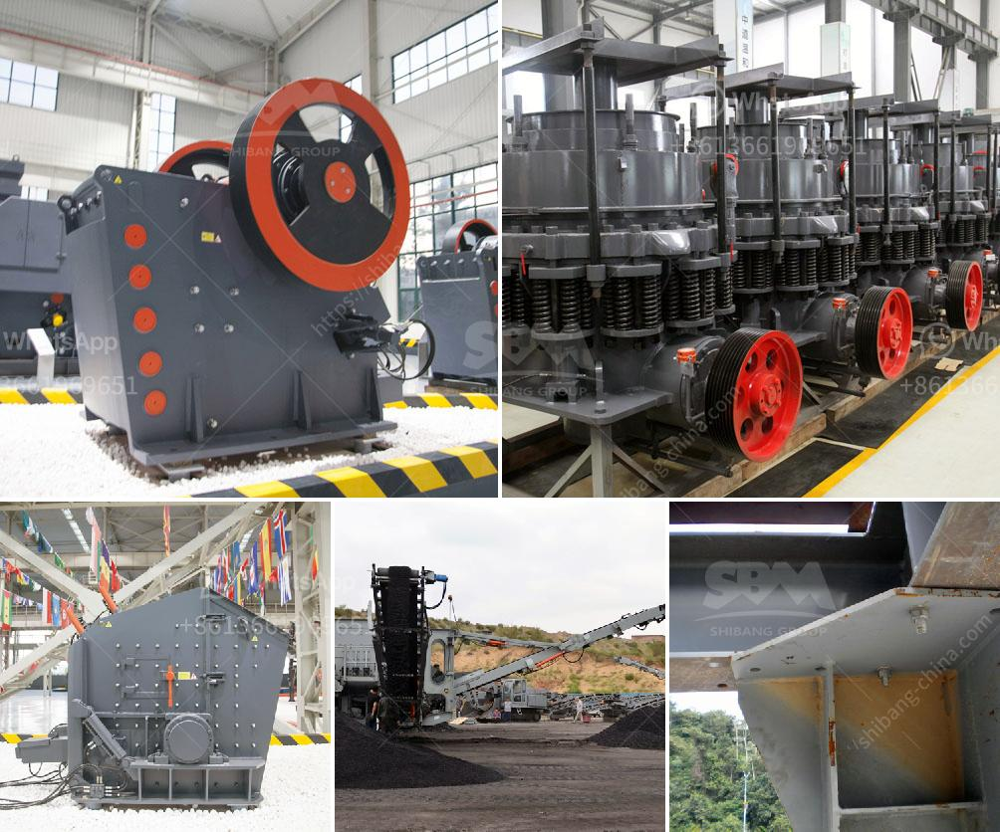

<h3>crushers manufactures in</h3>
Crushers are essential equipment in mining, construction, and recycling industries as they are responsible for crushing large rocks, stones, concrete, or any other materials into smaller particles. This process is crucial for various industries as it allows these materials to be reused or further processed for different purposes. The role of crushers in these industries cannot be understated, and therefore, finding the right crusher manufacturer becomes imperative.

There are numerous crusher manufacturers worldwide who produce a wide range of crushers catering to different industries and applications. These manufacturers ensure that their crushers are durable, efficient, and built to withstand heavy-duty operations. Many reputable manufacturers utilize advanced technologies to enhance their crushers' performance and optimize their output.

One such crusher manufacturer is ABC Crushers Manufacturing Co., which has been in the industry for over three decades. They specialize in manufacturing jaw crushers, cone crushers, impact crushers, and vertical shaft impact crushers for a variety of applications. Their crushers are known for their high-quality craftsmanship, durability, and unmatched performance.

Another prominent crusher manufacturer is XYZ Machines Ltd., renowned for their innovative and cutting-edge crushers that are widely used in the construction and mining sectors. XYZ Machines Ltd. offers a comprehensive range of crushers, including mobile crushers, tracked crushers, and stationary crushers, designed to meet the diverse needs of their customers.

Furthermore, PQR Enterprises is a leading crusher manufacturer known for their state-of-the-art designs and advanced technology. They strive to provide crushers that not only perform exceptionally well but also offer easy maintenance and operation. PQR Enterprises offers a wide range of crushers suitable for various applications, including quarrying, recycling, and demolition.

In conclusion, crushers are essential machinery in many industries, and selecting the right crusher manufacturer is crucial for ensuring optimal performance and durability. Numerous manufacturers across the globe produce crushers that cater to different industries and applications. Whether it is ABC Crushers Manufacturing Co., XYZ Machines Ltd., or PQR Enterprises, these manufacturers focus on innovation, advanced technology, and customer satisfaction to deliver high-quality crushers that meet the demanding requirements of today's industries.
<h3>Contact us</h3><ul><li><strong>Whatsapp:&nbsp;<a href="https://wa.me/8613661969651">+8613661969651</a></strong></li><li><a href="https://swt.shibang-china.com/?git&amp;zhl&amp;crushers manufactures in"><strong>Online Service(chat now)</strong></a></li></ul><h3>Related</h3><ul><li><a href='how to control partials size in vertical hammer mill.md'>how to control partials size in vertical hammer mill</a></li><li><a href='advantages of jaw crushers.md'>advantages of jaw crushers</a></li><li><a href='mobile crushing plant for rent in saudi arabia.md'>mobile crushing plant for rent in saudi arabia</a></li><li><a href='sale stone quarry crusher plant india.md'>sale stone quarry crusher plant india</a></li><li><a href='slag processing plant details.md'>slag processing plant details</a></li></ul>