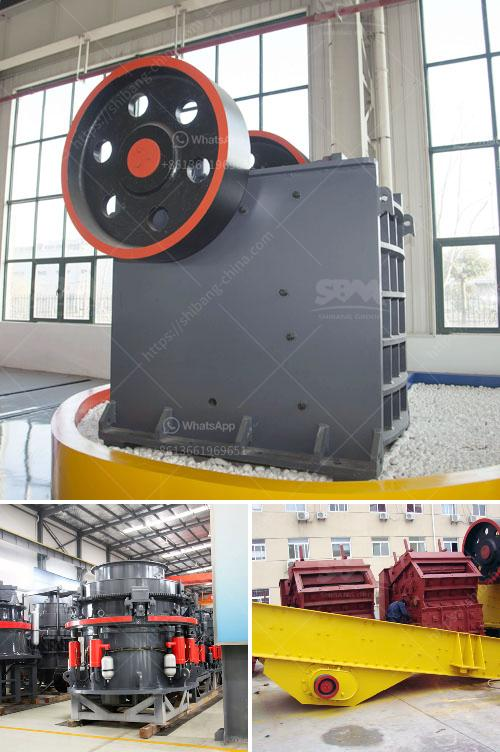

<h3>crushing and screening companies in south africa</h3>
Crushing and screening companies in South Africa are among the key players driving the robust growth of the mining and quarrying industry in the country. Renowned for their extensive technical expertise and superior-quality machinery, these companies provide assistance and support to some of the largest mining projects in the region.

One of the biggest advantages of choosing South African crushing and screening companies is their excellent track record in producing high-quality products for a wide range of applications. These companies offer a comprehensive range of crushers, screens, feeders, and conveyors, which are designed to efficiently process different types of materials, including minerals, ores, and aggregates.

The crushing and screening industry in South Africa has made considerable strides in technological advancements in recent years. Thanks to the continuous innovation and improvement in machinery and equipment, these companies provide highly efficient and reliable solutions that address the unique challenges faced by the mining and quarrying industry.

Another significant factor contributing to the success of crushing and screening companies in South Africa is their commitment to customer satisfaction. These companies understand the importance of providing a personalized approach and tailor-made solutions that meet the specific requirements of each client. Whether it is a large-scale mining operation or a smaller-scale quarry, these companies ensure that their customers receive the support and expertise needed to maximize productivity and profitability.

Furthermore, crushing and screening companies in South Africa emphasize sustainable practices and prioritize environmental responsibility. They take measures to minimize the impact on the environment through the efficient use of resources, waste management strategies, and adherence to strict regulations and standards. By investing in eco-friendly technologies and implementing sustainable practices, these companies contribute to the overall sustainability of the mining and quarrying sector.

Moreover, South African crushing and screening companies offer comprehensive after-sales support and maintenance services to ensure the continuous operation and optimal performance of their machinery and equipment. This commitment to post-sales service differentiates them from competitors and builds long-term relationships with customers. These companies also provide training and technical assistance to operators, enabling them to effectively operate and maintain the machinery for increased productivity and reduced downtime.

In conclusion, the crushing and screening companies in South Africa play a crucial role in driving the growth of the mining and quarrying industry. With their technical expertise, superior-quality machinery, sustainable practices, and customer-centric approach, these companies provide valuable solutions to mining projects of all sizes. As the industry continues to evolve, these companies will undoubtedly remain at the forefront and continue to contribute to the success of the mining and quarrying sector in South Africa.
<h3>Contact us</h3><ul><li><strong>Whatsapp:&nbsp;<a href="https://wa.me/8613661969651">+8613661969651</a></strong></li><li><a href="https://swt.shibang-china.com/?git&amp;zhl&amp;crushing and screening companies in south africa"><strong>Online Service(chat now)</strong></a></li></ul><h3>Related</h3><ul><li><a href='sand stone crusher.md'>sand stone crusher</a></li><li><a href='quarry ccrusher equipment price.md'>quarry ccrusher equipment price</a></li><li><a href='grinding raymond dolomite.md'>grinding raymond dolomite</a></li><li><a href='copper ore quarry equipment manufacturer in thailand.md'>copper ore quarry equipment manufacturer in thailand</a></li><li><a href='rotary kiln design calculation pdf.md'>rotary kiln design calculation pdf</a></li></ul>