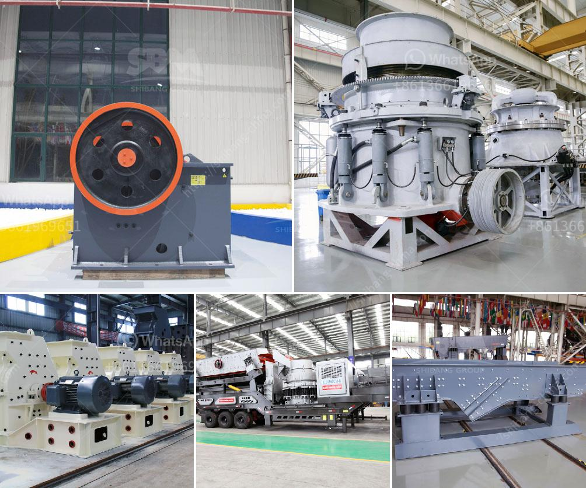

<h3>crushing and screening machinery</h3>
Crushing and screening machinery play a vital role in the construction industry. This equipment allows the construction sites to recycle materials, reducing the need for new ones and contributing to sustainability. It also aids in the efficient processing of raw materials, ensuring that the desired outcome is achieved during construction projects.

Crushing machinery refers to equipment that uses mechanical force to break down large rocks into smaller pieces. This process is essential in various industries such as mining, construction, and recycling. The primary goal of crushing machinery is to reduce the size of the material for further processing or to make it suitable for use in construction.

There are different types of crushing machinery available, including jaw crushers, cone crushers, impact crushers, and gyratory crushers. Each type has its own unique features and benefits, depending on the specific requirements of the project. For example, jaw crushers are ideal for primary crushing as they can handle a wide range of materials, including concrete, asphalt, and natural stone.

Screening machinery, on the other hand, is used to separate materials of different sizes. Its primary function is to ensure that only the desired size of material passes through for further processing. Screening machinery is commonly used in the mining and construction industries to classify and separate materials such as sand, gravel, and crushed stone.

There are various types of screening machinery, including vibrating screens, trommel screens, and flip-flop screens. Vibrating screens use vibration to separate materials based on size, while trommel screens use a rotating drum to separate materials by size. Flip-flop screens, on the other hand, are ideal for screening sticky materials as they allow for effective sorting without clogging.

The integration of crushing and screening machinery offers numerous benefits in construction projects. By combining the two processes, the entire operation becomes more efficient and streamlined. Materials can be directly fed into the crushing machinery, undergo the crushing process, and then be screened for further processing or distribution.

One of the main advantages of using crushing and screening machinery is that it reduces the need for new raw materials. By recycling materials like concrete and asphalt, construction sites can contribute to sustainability by minimizing waste and reusing valuable resources. Additionally, crushed materials can often be repurposed for various applications, including road construction, landscaping, and erosion control.

Furthermore, crushing and screening machinery also improves the quality of the end product. By breaking down large rocks, the machinery ensures that the desired size and shape of the material are achieved. This is vital for construction projects, as it ensures that the final product meets the required specifications and performs as intended.

In conclusion, crushing and screening machinery are instrumental in construction projects, enabling efficient processing of raw materials and reducing the need for new ones. The integration of these machines streamlines operations and improves sustainability by recycling materials. Additionally, they ensure that the final product meets the required specifications, contributing to the overall success of construction projects.
<h3>Contact us</h3><ul><li><strong>Whatsapp:&nbsp;<a href="https://wa.me/8613661969651">+8613661969651</a></strong></li><li><a href="https://swt.shibang-china.com/?git&amp;zhl&amp;crushing and screening machinery"><strong>Online Service(chat now)</strong></a></li></ul><h3>Related</h3><ul><li><a href='raymond mill for limestone india supplier.md'>raymond mill for limestone india supplier</a></li><li><a href='cone crusher contractors in egypt.md'>cone crusher contractors in egypt</a></li><li><a href='jaw crushers china.md'>jaw crushers china</a></li><li><a href='mobile crusher 150 tons capacity.md'>mobile crusher 150 tons capacity</a></li><li><a href='crusher machine for sale in pakistan.md'>crusher machine for sale in pakistan</a></li></ul>