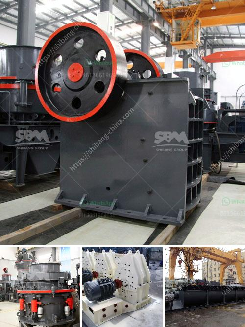

<h3>crushing and screening plant rental</h3>
Crushing and screening plants are machinery units that have been designed to process stones and rocks into smaller fragments. They are often used in mining operations and construction projects to help break down and dispose of waste materials, creating high-quality products for various industries.

One option for obtaining a crushing and screening plant is through rental services. Rental options provide a cost-effective and flexible solution for businesses that need temporary access to these machines. This article will explore the benefits of renting a crushing and screening plant and how it can improve project efficiency.

One of the main advantages of renting a crushing and screening plant is the ability to access state-of-the-art equipment without having to make a significant investment. Purchasing a plant can be expensive, and for short-term projects, renting is a more practical option. By renting, businesses can utilize modern machinery that is well-maintained and efficient, resulting in improved productivity and reduced downtime.

Renting offers flexibility that purchasing does not. Different projects may require specific equipment with varying capacities and capabilities. With a rental, companies have the freedom to choose the most suitable plant for their specific needs. They can also take advantage of the latest models and technologies, ensuring optimal performance and quality output.

Furthermore, renting a crushing and screening plant allows businesses to tap into the expertise of experienced operators. Rental companies often provide skilled professionals who are proficient in operating and maintaining the equipment. This eliminates the need to hire and train additional staff, saving time and resources. The operators can also offer valuable advice and guidance on how to maximize productivity and achieve the desired results.

Renting a crushing and screening plant also offers a more sustainable approach to project management. Construction and mining operations generate a substantial amount of waste material, and efficient recycling is crucial for reducing environmental impact. By using a rental plant, businesses can crush and screen waste materials on-site, reducing transportation costs and minimizing the need for landfill space.

In addition to the environmental benefits, renting a crushing and screening plant can also improve project timelines. Having direct access to the equipment allows for faster mobilization and setup, enabling projects to start promptly. Moreover, rental companies often have reliable delivery and support services, ensuring that plants are delivered on time and that any technical issues are promptly addressed, minimizing project delays.

Overall, renting a crushing and screening plant provides numerous advantages for businesses in need of temporary access to these machines. Cost savings, flexibility, access to modern equipment, experienced operators, and sustainability are just a few of the benefits that can greatly enhance project efficiency. Rental services are an excellent option for companies looking to maximize productivity and achieve high-quality outputs without the burden of long-term investments.
<h3>Contact us</h3><ul><li><strong>Whatsapp:&nbsp;<a href="https://wa.me/8613661969651">+8613661969651</a></strong></li><li><a href="https://swt.shibang-china.com/?git&amp;zhl&amp;crushing and screening plant rental"><strong>Online Service(chat now)</strong></a></li></ul><h3>Related</h3><ul><li><a href='quarry stone crusher for sale in south africa.md'>quarry stone crusher for sale in south africa</a></li><li><a href='coal washing plant indonesia.md'>coal washing plant indonesia</a></li><li><a href='cone crusher mobile.md'>cone crusher mobile</a></li><li><a href='vertical roller mill for cement grinding.md'>vertical roller mill for cement grinding</a></li><li><a href='german made jaw crusher prices.md'>german made jaw crusher prices</a></li></ul>