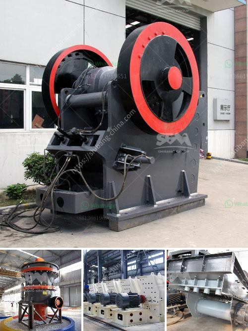

<h3>crushing complete crushing plant 80 120tph hard rock</h3>
Crushing plants are essential for the construction industry, as they enable the processing of raw materials into a more manageable form. These plants are specifically designed to crush various types of rocks, creating aggregate materials that can be used in construction projects.

One such crushing plant is the 80-120tph Hard Rock Plant, which is ideal for small-scale production line. This plant is designed to crush medium hard rock with a production capacity of 80-120tph. Such rock types may include granite, basalt, diabase, andesite, and limestone, among others.

The 80-120tph Hard Rock Plant includes jaw crusher, impact crusher, and cone crusher for crushing these materials. These crushers are known for their high efficiency, low operating costs, and high production outputs, making them popular choices for many mining investors.

The jaw crusher is commonly used as the primary crusher in the crushing process. It has a high crushing ratio and a wide feeding size range, making it suitable for various rocks. The impact crusher, on the other hand, is designed to crush materials with a higher degree of hardness. It utilizes a high-speed impact force to break the rocks, resulting in uniform and cubical shaped particles.

The cone crusher is used for finer crushing, as it can produce high-quality aggregates with excellent particle shape. It is equipped with a hydraulic system, allowing for easy adjustment of the discharge setting. This enables the production of different sizes of aggregates, making it a versatile option for various construction projects.

In addition to these crushers, the 80-120tph Hard Rock Plant also includes a vibrating feeder, vibrating screen, belt conveyor, and control panel. These components work together to ensure a smooth and efficient crushing process. The vibrating feeder enables a constant and controlled feeding of materials into the crushers, while the vibrating screen ensures the proper screening of the crushed materials.

The belt conveyor is responsible for transferring the crushed materials to their respective storage areas or the next stage of the process. It is designed to handle heavy loads and has a high conveying capacity. The control panel, on the other hand, allows for the easy monitoring and control of the entire crushing plant.

Overall, the 80-120tph Hard Rock Plant is a reliable and efficient option for crushing medium hard rocks. With its high production capacity and low operating costs, it is a cost-effective solution for many construction projects. Whether it is used in road construction, building construction, or other infrastructure projects, this crushing plant is designed to deliver consistent and high-quality aggregates.
<h3>Contact us</h3><ul><li><strong>Whatsapp:&nbsp;<a href="https://wa.me/8613661969651">+8613661969651</a></strong></li><li><a href="https://swt.shibang-china.com/?git&amp;zhl&amp;crushing complete crushing plant 80 120tph hard rock"><strong>Online Service(chat now)</strong></a></li></ul><h3>Related</h3><ul><li><a href='limestone crusher hammers.md'>limestone crusher hammers</a></li><li><a href='limestone crushers for sale.md'>limestone crushers for sale</a></li><li><a href='simple stone crushers kenya.md'>simple stone crushers kenya</a></li><li><a href='quartz manufacturing plant in india.md'>quartz manufacturing plant in india</a></li><li><a href='100tph jaw crusher and ball mill.md'>100tph jaw crusher and ball mill</a></li></ul>