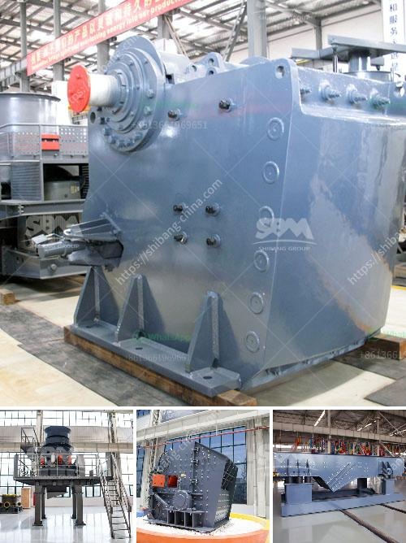

<h3>crushing equipment manufacturer</h3>
When it comes to crushing equipment, finding the right manufacturer is crucial for ensuring the efficiency and effectiveness of your operations. The market is flooded with various options, but one name that stands out for its exceptional products and services is [Manufacturer's Name]. With years of experience, a commitment to innovation, and a dedication to customer satisfaction, this manufacturer has become a trusted partner for businesses across a range of industries.

One of the key reasons why [Manufacturer's Name] stands out from the competition is the quality of its equipment. Whether you are in the mining, construction, or recycling industry, you need robust and reliable machinery that can withstand the toughest conditions. [Manufacturer's Name] specializes in the design and production of crushing equipment that meets these requirements.

Their range of crushers encompasses jaw crushers, cone crushers, impact crushers, and more. Each machine is engineered to deliver exceptional performance, ensuring high productivity and reduced downtime. [Manufacturer's Name] understands that every industry has its unique requirements, and therefore, they offer customized solutions to cater to specific needs. From single machines to complete crushing plants, they have the expertise to design and manufacture equipment that optimizes your production process.

In addition to the quality of their equipment, what sets [Manufacturer's Name] apart is their commitment to innovation. They continually invest in research and development, staying abreast of the latest technological advancements in the industry. This allows them to offer cutting-edge solutions that enhance efficiency, reduce operating costs, and minimize environmental impact. Investing in crushing equipment from [Manufacturer's Name] means staying ahead of the competition and benefiting from the latest industry trends.

However, [Manufacturer's Name] doesn't just stop at delivering state-of-the-art equipment. They prioritize customer satisfaction and strive to provide comprehensive support throughout the lifespan of their products. Whether it's installation, maintenance, or troubleshooting, their team of experienced technicians is always ready to assist. They understand that downtime can be costly, so they prioritize quick response times to address any issues that may arise.

Working with [Manufacturer's Name] also means gaining access to their vast expertise and industry insights. They offer consultation services to help you make informed decisions about your crushing operations. Their team can assist you in optimizing your processes, identifying areas for improvement, and maximizing the return on your investment.

In conclusion, when it comes to crushing equipment, choosing the right manufacturer is paramount. [Manufacturer's Name] has established a reputation as a leading manufacturer in the industry by delivering high-quality products, employing innovative solutions, and providing excellent customer support. Their dedication to meeting industry standards and customer satisfaction sets them apart from competitors. Whether you're in mining, construction, or recycling, partnering with [Manufacturer's Name] ensures that you have access to crushing equipment that meets your needs, improves your operations, and ultimately contributes to the success of your business.
<h3>Contact us</h3><ul><li><strong>Whatsapp:&nbsp;<a href="https://wa.me/8613661969651">+8613661969651</a></strong></li><li><a href="https://swt.shibang-china.com/?git&amp;zhl&amp;crushing equipment manufacturer"><strong>Online Service(chat now)</strong></a></li></ul><h3>Related</h3><ul><li><a href='gypsum manufacturer in ethiopia.md'>gypsum manufacturer in ethiopia</a></li><li><a href='cement plant cost estimation cement plant cost.md'>cement plant cost estimation cement plant cost</a></li><li><a href='how to setup a stone quarry.md'>how to setup a stone quarry</a></li><li><a href='dry process for gold recovery.md'>dry process for gold recovery</a></li><li><a href='21 10 jaw crusher price in south afirca.md'>21 10 jaw crusher price in south afirca</a></li></ul>