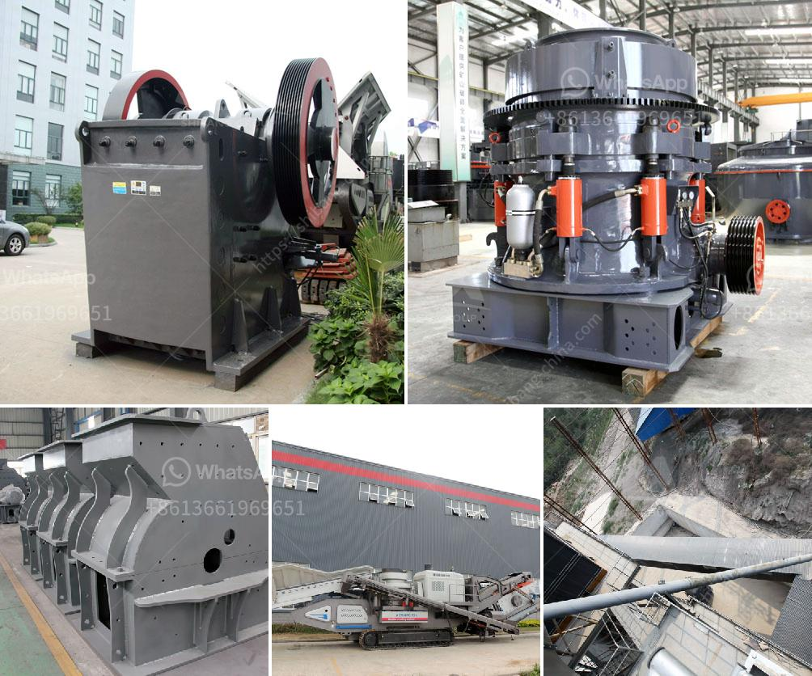

<h3>crushing hpc cone crusher</h3>
In today's rapidly growing mining industry, the need for efficient and cost-effective crushing solutions has become more important than ever. With the increasing demand for various minerals and aggregates, companies are constantly searching for cutting-edge technologies that can enhance their operational productivity. One such technology that has revolutionized the crushing industry is the HPC Cone Crusher. This advanced crusher offers a range of benefits, making it an ideal choice for businesses looking to optimize their crushing processes.

The HPC Cone Crusher, also known as the Hydraulic Cone Crusher, is a high-performance crusher designed to provide high level of reliability and versatility. It is suitable for secondary and tertiary crushing applications in mining, quarrying, and recycling industries. The key feature of this crusher lies in its hydraulic adjustment system, which allows users to easily adjust the crusher settings to achieve the desired product size. Additionally, it incorporates a unique crushing chamber design that maximizes crushing efficiency and minimizes wear and tear on the equipment.

One of the major advantages of the HPC Cone Crusher is its exceptional crushing capabilities. With its high crushing ratio and fine product size, this crusher can efficiently process a wide range of materials, including hard and abrasive ones. The use of advanced technology, such as the hydraulic system and tramp release mechanism, ensures that the crusher can handle even the toughest materials without any risk of damage. This makes the HPC Cone Crusher an excellent choice for crushing hard rocks, ores, and minerals.

Along with its exceptional performance, the HPC Cone Crusher also offers enhanced operational safety. The hydraulic system not only provides quick and easy adjustment of the crusher settings but also helps prevent any damage that may occur due to material overload. The tramp release mechanism ensures that the crusher automatically releases any uncrushable material, preventing costly equipment damage and downtime. Additionally, the crusher's high-quality components and robust construction ensure long-lasting and reliable operation, reducing the risk of unexpected breakdowns and maintenance interruptions.

Another key advantage of the HPC Cone Crusher is its user-friendly design. It features a simple and intuitive control panel that allows operators to easily monitor and adjust the crusher's performance. The crusher's compact size and lightweight construction make it easy to transport and install, ensuring a quick and hassle-free setup process. Furthermore, the crusher's low energy consumption and minimal maintenance requirements make it a cost-effective solution for businesses of all sizes.

In conclusion, the HPC Cone Crusher offers a revolutionary solution for efficient crushing in the mining, quarrying, and recycling industries. Its high-performance capabilities, enhanced operational safety, and user-friendly design make it an ideal choice for optimizing crushing processes. Whether processing hard rocks or abrasive materials, this crusher provides exceptional performance, durability, and cost-effectiveness. By investing in the HPC Cone Crusher, businesses can significantly enhance their crushing operations, ensuring a higher level of productivity and profitability.
<h3>Contact us</h3><ul><li><strong>Whatsapp:&nbsp;<a href="https://wa.me/8613661969651">+8613661969651</a></strong></li><li><a href="https://swt.shibang-china.com/?git&amp;zhl&amp;crushing hpc cone crusher"><strong>Online Service(chat now)</strong></a></li></ul><h3>Related</h3><ul><li><a href='vertical roller mill manufacturers.md'>vertical roller mill manufacturers</a></li><li><a href='german made jaw crusher prices.md'>german made jaw crusher prices</a></li><li><a href='stone crusher machinery china.md'>stone crusher machinery china</a></li><li><a href='cost of small scale cement plant.md'>cost of small scale cement plant</a></li><li><a href='grinding media loading in ball mill machine.md'>grinding media loading in ball mill machine</a></li></ul>