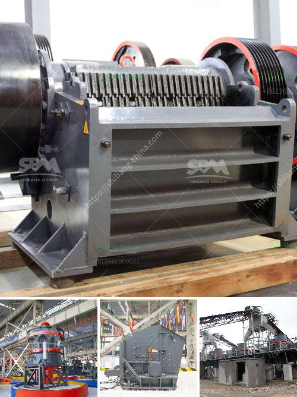

<h3>crushing machine from china</h3>
In the vast construction and mining industries, rock crushing machines are essential equipment. However, the high demand for these machines has led to an oversaturation of the market, resulting in a plethora of options to choose from. One country that has been making waves in this industry is China, with their innovative and efficient crushing machines.

China has long been known for its impressive engineering feats, and their crushing machines are no exception. These machines are designed to crush large rocks into smaller aggregate materials, which can be utilized for various construction projects and road maintenance. Their efficiency and reliability have made them popular not only in China but also in many countries around the world.

One key feature that sets Chinese crushing machines apart from their competitors is their high crushing ratio. This ratio refers to the size of the output compared to the size of the input. Chinese machines have been engineered to ensure maximum productivity, providing users with smaller and more uniform-sized materials. This not only saves time but also reduces the need for further crushing or screening processes.

Another notable feature of Chinese crushing machines is their durability. The construction industry often exposes equipment to extreme working conditions, such as constant exposure to heavy rocks and debris. Chinese machines are manufactured using high-quality materials, ensuring their longevity and resistance to wear and tear. This not only saves money in terms of maintenance and replacement costs but also boosts overall productivity.

Chinese crushing machines are also designed with user-friendliness in mind. They are equipped with advanced control systems, allowing operators to easily adjust settings and monitor performance. These not only make the machines more efficient but also reduce the risk of human error, promoting a safer working environment. Additionally, Chinese manufacturers provide comprehensive training and support to ensure that operators can utilize the machines to their full potential.

Concerns about the environment are at an all-time high, and Chinese crushing machines are designed to address these issues. Many Chinese manufacturers have implemented eco-friendly practices in their production processes, utilizing energy-efficient technologies and reducing carbon emissions. Additionally, Chinese crushing machines are engineered with noise reduction features, minimizing noise pollution on construction sites, and surrounding areas.

The Chinese crushing machine industry has seen tremendous growth in recent years, reflecting the country's dedication to technological advancements. Chinese manufacturers continually invest in research and development, striving to improve efficiency while reducing environmental impact. Their commitment to innovation has allowed them to stay competitive in the global market, providing high-quality and cost-effective crushing machines.

In summary, Chinese crushing machines have revolutionized the construction and mining industries with their innovative design, high crushing ratio, durability, user-friendliness, and eco-friendly features. These machines have become a driving force behind infrastructure development worldwide, enabling projects to be completed efficiently and sustainably. As China continues to invest in research and development, the future of crushing machines from China looks promising, with even greater advancements on the horizon.
<h3>Contact us</h3><ul><li><strong>Whatsapp:&nbsp;<a href="https://wa.me/8613661969651">+8613661969651</a></strong></li><li><a href="https://swt.shibang-china.com/?git&amp;zhl&amp;crushing machine from china"><strong>Online Service(chat now)</strong></a></li></ul><h3>Related</h3><ul><li><a href='granite stone jaw crushers.md'>granite stone jaw crushers</a></li><li><a href='diesel engine small stone crusher.md'>diesel engine small stone crusher</a></li><li><a href='prices of cement clinker grinding unit in india.md'>prices of cement clinker grinding unit in india</a></li><li><a href='ballast crusher plant.md'>ballast crusher plant</a></li><li><a href='pebble stone processing machines.md'>pebble stone processing machines</a></li></ul>