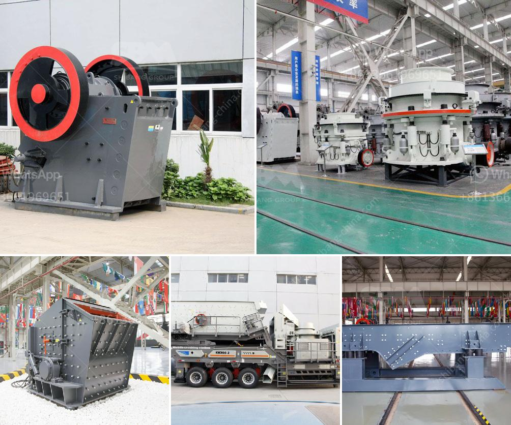

<h3>crushing machine in ghana</h3>
The Republic of Ghana, located on the west coast of Africa, is one of the most thriving democracies on the continent. It has often been referred to as an "island of peace" in one of the most chaotic regions globally. Ghana is known for its rich cultural heritage, abundant natural resources, and vibrant economic activities, making it an attractive destination for investors.

One sector that has been pivotal to Ghana's rapid economic growth is the mining industry. It accounts for about 5% of the country's GDP and has played a significant role in the development of infrastructure. With the rising demand for precious metals and minerals, Ghana is home to various gold mines, which are highly mechanized and utilize advanced crushing machines.

Crushing machines are used in the extraction process of valuable minerals and metals from the earth. These machines ensure a productive and efficient process in the mining industry, where ores and rocks are often extracted from a large scale and transported to the crushing sites. The crushing machines reduce large rocks into smaller manageable sizes, which can then be transported for further processing.

One of the leading countries in the production of gold in Africa, Ghana has developed several large-scale gold mines, with increasing investments from both local and foreign entities. These mines heavily rely on crushing machines to facilitate the extraction process. The machines are designed with advanced technology and equipped with intricate systems that ensure high productivity.

The use of crushing machines in the mining industry has contributed immensely to Ghana's economic growth. This is evident through the surge in gold exports, which have fueled the country's foreign exchange earnings. Gold mining in Ghana has provided jobs to over 10,000 Ghanaians directly and over 20,000 indirectly, representing an important source of income in the country.

Furthermore, the use of crushing machines has led to an improvement in the mining sector's contribution to the overall GDP. The industry's growth has boosted the country's revenue, enabling the government to invest in crucial sectors such as healthcare, education, and infrastructure development.

Despite the numerous benefits associated with the use of crushing machines in Ghana's mining industry, there are also some challenges that need to be addressed. These include environmental concerns, health and safety issues, and the need for skilled labor to operate and maintain these machines.

To mitigate the environmental impact, mining companies in Ghana are required to adhere to strict regulations in terms of waste management and land reclamation. The government has also implemented policies to promote responsible mining practices, ensuring that the extraction processes do not harm nearby communities and ecosystems.

In conclusion, crushing machines play a vital role in Ghana's mining industry, particularly in the extraction of gold and other valuable minerals. These machines have contributed significantly to the country's economic growth, providing employment opportunities and boosting revenue generation. However, it is crucial that proper regulations and measures are in place to minimize environmental impact and ensure the safety of workers. With continued investment in the mining sector and a commitment to sustainable practices, Ghana has the potential to further enhance its position as a leading player in the global mining industry.
<h3>Contact us</h3><ul><li><strong>Whatsapp:&nbsp;<a href="https://wa.me/8613661969651">+8613661969651</a></strong></li><li><a href="https://swt.shibang-china.com/?git&amp;zhl&amp;crushing machine in ghana"><strong>Online Service(chat now)</strong></a></li></ul><h3>Related</h3><ul><li><a href='gold mining equipment plant for sales.md'>gold mining equipment plant for sales</a></li><li><a href='sells hammer mills in zimbabwe.md'>sells hammer mills in zimbabwe</a></li><li><a href='hammer crusher taiwan.md'>hammer crusher taiwan</a></li><li><a href='bando rubber conveyor belt pdf.md'>bando rubber conveyor belt pdf</a></li><li><a href='stone quarry crusher machines.md'>stone quarry crusher machines</a></li></ul>