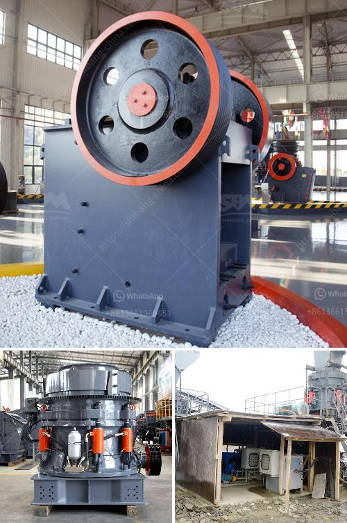

<h3>crushing machine south africa</h3>
Crushing machines play an essential role in the mining and quarrying industry in South Africa. They facilitate the crushing and processing of raw materials which are extracted from various mines to produce smaller aggregates and powders. These machines are designed to break down large rocks, stones, and ores into smaller, more manageable sizes.

South Africa is home to a wide range of minerals, with some of the deepest mines in the world. These mines require efficient and high-capacity crushing machines to meet the demands of their operations. Whether it is coal, gold, diamond, or any other precious metal or mineral, these crushing machines are crucial in processing the raw materials.

The crushing machine industry in South Africa has been growing rapidly due to the rising demand for these machines in various mining and quarrying activities. The development of infrastructure, such as roads and railways, as well as the expansion of the construction industry, has led to an increased demand for crushed materials.

One of the primary crushing machines used in South Africa is the jaw crusher. Jaw crushers are common in many industries, including mining, construction, smelting, and chemical processing. They are versatile machines designed to handle a wide range of brittle materials, such as limestone, coal, glass, and even concrete.

Another crushing machine commonly used in South Africa is the cone crusher. It is similar to the jaw crusher, but operates with a gyrating cone instead of a fixed jaw. This machine is highly efficient and produces excellent particle size distribution, making it suitable for various applications in the mining industry.

Crushing machines in South Africa are also equipped with various safety features to protect operators and prevent accidents. These features include emergency stop buttons, guardrails, and sensors that detect any potential blockages or malfunctions. Additionally, many machines are equipped with advanced automation systems, allowing remote monitoring and control to enhance safety and optimize performance.

In conclusion, the crushing machine industry in South Africa is vital for the mining and quarrying sector. These machines enable efficient and precise crushing of raw materials, contributing to the production of aggregates and powders needed for various industries. With the continuous growth in infrastructure development and mineral extraction, South Africa is expected to witness a further increase in demand for crushing machines.
<h3>Contact us</h3><ul><li><strong>Whatsapp:&nbsp;<a href="https://wa.me/8613661969651">+8613661969651</a></strong></li><li><a href="https://swt.shibang-china.com/?git&amp;zhl&amp;crushing machine south africa"><strong>Online Service(chat now)</strong></a></li></ul><h3>Related</h3><ul><li><a href='crusher specification.md'>crusher specification</a></li><li><a href='bauxite mining process flow chart germany.md'>bauxite mining process flow chart germany</a></li><li><a href='grinding machines for minerals in indonesia.md'>grinding machines for minerals in indonesia</a></li><li><a href='mobile dimension stone processing dressing cutting.md'>mobile dimension stone processing dressing cutting</a></li><li><a href='crushing machine from china.md'>crushing machine from china</a></li></ul>