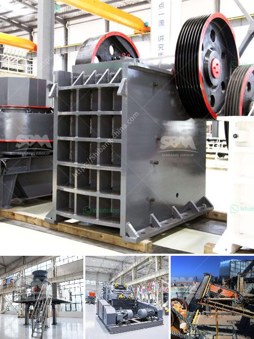

<h3>crushing milling machine for graphite powder</h3>
Graphite is a versatile industrial mineral with unique properties that have facilitated technological advancements in various industries. One of the key uses of graphite is as a lubricant due to its excellent thermal and electrical conductivity, low friction coefficient, and high temperature resistance. To harness its full potential, graphite needs to be processed into a fine powder, which is where crushing milling machines come into play.

The primary goal of crushing milling machines is to break down graphite chunks or lumps into smaller particles or powder with a desired fineness. By doing so, the graphite powder can be easily suspended in lubricating oils or other mediums for various applications. This process not only enhances the material's versatility but also facilitates its efficient utilization in modern industries.

The two main types of crushing milling machines used for graphite powder production are impact crushers and ball mills. Impact crushers, also known as hammer mills, use high-speed rotating shafts with hammer-like attachments to accelerate the fragmentation of the graphite material. As the material enters the crushing chamber, it collides with the rapidly rotating hammers, shattering into smaller pieces. The crushed graphite particles are then discharged through screens or grates of predetermined sizes. Impact crushers are known for their high production rates and flexibility in adjusting the powder's final size.

On the other hand, ball mills rely on the mechanical impact and attrition forces between grinding media (usually steel balls) and the graphite material. As the rotating cylinder of the ball mill cascades the grinding media, it crushes the graphite particles against the inner wall of the cylinder, resulting in their fragmentation into smaller sizes. The advantage of ball mills lies in their ability to produce a uniform and fine powder with precise control over the particle size distribution.

One key consideration in selecting the appropriate crushing milling machine for graphite powder is the desired fineness. This is determined by the specific application requirements, such as the particle size needed for effective lubrication or the characteristics desired for electrode materials in the battery industry. It is essential to choose a machine that can achieve the desired fineness efficiently and economically.

Another important factor to consider when selecting a crushing milling machine for graphite powder is the machine's durability and maintenance requirements. Graphite is a relatively abrasive material that can accelerate wear and tear on machine parts. Therefore, it is crucial to choose a machine that utilizes durable materials and has robust design features to withstand the rigors of graphite processing. Additionally, regular maintenance and lubrication are essential to ensure optimal machine performance and longevity.

In conclusion, crushing milling machines play a vital role in the production of graphite powder. Whether through impact crushers or ball mills, these machines break down graphite chunks into smaller particles or powder with the desired fineness. Selecting the appropriate machine for graphite powder production involves considering factors such as the desired particle size distribution, machine durability, and maintenance requirements. By effectively processing graphite into a fine powder, its unique properties can be harnessed to enhance technological advancements in various industries.
<h3>Contact us</h3><ul><li><strong>Whatsapp:&nbsp;<a href="https://wa.me/8613661969651">+8613661969651</a></strong></li><li><a href="https://swt.shibang-china.com/?git&amp;zhl&amp;crushing milling machine for graphite powder"><strong>Online Service(chat now)</strong></a></li></ul><h3>Related</h3><ul><li><a href='price of roller mill machine.md'>price of roller mill machine</a></li><li><a href='used ball mills in india.md'>used ball mills in india</a></li><li><a href='mobile crushing and screening plant.md'>mobile crushing and screening plant</a></li><li><a href='vibratory screen south africa.md'>vibratory screen south africa</a></li><li><a href='ethiopia conveyor belt india.md'>ethiopia conveyor belt india</a></li></ul>