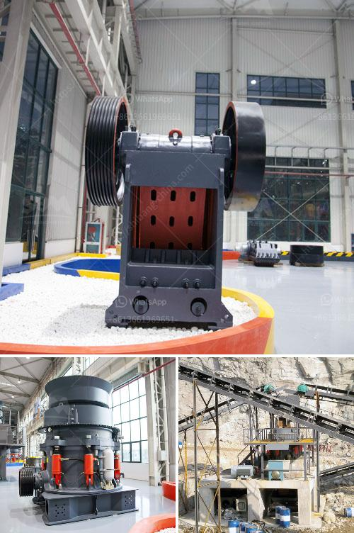

<h3>crushing of calcined bauxite</h3>
Calcined bauxite is a versatile mineral that is used in various industries, such as refractory, abrasive, ceramics, steel making, and cement production. It is obtained through the calcination (heating) process of bauxite, an aluminum ore mined from earth’s crust. Calcined bauxite is a crucial material in the production of aluminum, as it provides essential properties required for the manufacturing of aluminum products.

The process of crushing calcined bauxite plays a vital role in the production of aluminum. Before it can be utilized, it must be crushed into different sizes. This article will explore the process of crushing calcined bauxite and highlight its significance in aluminum production.

The first step in crushing calcined bauxite is to extract the raw material. Bauxite ore is mined from deposits found in various locations, including countries like Australia, Guinea, Brazil, and India. Once bauxite ore is extracted, it undergoes a process known as calcination.

Calcination involves heating the bauxite ore in a rotary kiln at high temperatures, typically between 800 and 1600 degrees Celsius. This process eliminates the moisture content present in the ore and converts it into a more stable and usable form called calcined bauxite. Calcined bauxite is a white, gray, or reddish-brown solid substance with a high aluminum content.

After the calcination process, the next step is to crush the calcined bauxite into different sizes. Crushing is carried out using various types of crushers, such as jaw crushers, cone crushers, impact crushers, and hammer crushers. Each crusher type has its unique characteristics and is suitable for different applications.

The main objective of crushing calcined bauxite is to reduce the size of the material to meet specific requirements. The crushed material is then screened to obtain the desired particle sizes, which can range from coarse aggregates to fine powders. These different sizes are used in various applications within the aluminum industry.

Crushed calcined bauxite is a crucial component in the production of aluminum products, such as aluminum sheets, foils, and extrusions. It is mixed with other materials, such as aluminum oxide and binders, to form a paste or slurry. This paste is then shaped into desired forms using specialized equipment and processes like rolling, extrusion, or casting.

The crushed calcined bauxite is also utilized in the production of refractories. Refractories are heat-resistant materials used to line high-temperature equipment like furnaces and kilns. The properties of calcined bauxite, such as high melting point, thermal stability, and resistance to chemical reactions, make it an ideal material for refractory applications.

Additionally, crushed calcined bauxite is used in the manufacturing of abrasives, ceramics, and cement. In abrasive applications, it is mixed with other materials to create abrasive products used for grinding, polishing, and sanding. In ceramics, it acts as a fluxing agent that helps lower the melting point and increase the strength of ceramic products. In cement production, it is utilized as an additive to enhance the properties of cement.

In conclusion, crushing calcined bauxite is a crucial step in the production of aluminum and its related industries. It involves extracting bauxite ore, calcination to produce calcined bauxite, and crushing it into different sizes. The crushed material is then used in various applications, including the manufacturing of aluminum, refractories, abrasives, ceramics, and cement. Thus, the crushing process of calcined bauxite plays a significant role in supporting the aluminum industry and its downstream sectors.
<h3>Contact us</h3><ul><li><strong>Whatsapp:&nbsp;<a href="https://wa.me/8613661969651">+8613661969651</a></strong></li><li><a href="https://swt.shibang-china.com/?git&amp;zhl&amp;crushing of calcined bauxite"><strong>Online Service(chat now)</strong></a></li></ul><h3>Related</h3><ul><li><a href='crusher price in nepal.md'>crusher price in nepal</a></li><li><a href='crusher stone prices peru.md'>crusher stone prices peru</a></li><li><a href='used philippines jaw crushers.md'>used philippines jaw crushers</a></li><li><a href='concrete crushing machine cost.md'>concrete crushing machine cost</a></li><li><a href='gold washer machine manufacturer.md'>gold washer machine manufacturer</a></li></ul>