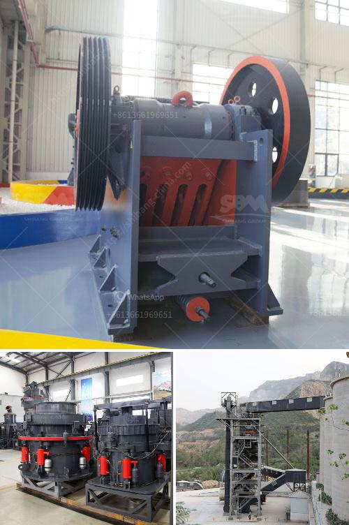

<h3>crushing of iron ore</h3>
Iron ore is an essential raw material for the production of steel, one of the most widely used materials in the world. Iron ore is mined from the earth's crust in the form of rock and subsequently processed to separate the valuable iron from the waste materials. Crushing is a vital process, taking place at the initial stage of iron ore beneficiation, where raw ore is crushed to fractions smaller than six inches. This article focuses on the importance of crushing in the iron ore processing chain and highlights the techniques and machinery used for this purpose.

The initial step in the production of iron ore is crushing the ore into smaller particle sizes so that it can be easily transported and processed in further steps. Crushing primarily aims at breaking down large chunks of ore into manageable particles suitable for downstream processing. It involves the use of various crushing machinery, such as jaw crushers, gyratory crushers, and cone crushers, which operate by applying pressure to the ore. This compression force helps break the ore into smaller pieces.

Crushing is key in iron ore beneficiation, as it helps to liberate the desired iron minerals from the waste gangue minerals. Separating the iron minerals from the gangue minerals is crucial for producing high-quality, saleable iron ore products. The crushed ore undergoes further processing, such as grinding and magnetic separation, to improve the iron content and remove impurities.

Multiple crushing techniques and machinery are used for iron ore crushing. Jaw crushers are commonly used as primary crushers due to their versatility and easy maintenance. Gyratory crushers, often used in large-scale operations, can handle larger rocks and have higher throughput rates. Cone crushers are favored for their ability to produce finer grades of ore.

Achieving an optimal crushing process requires careful attention to factors such as the ore's hardness, size distribution, and moisture content. These parameters can affect the equipment selection, operating parameters, and the overall efficiency of the crushing process. Proper maintenance of crushing equipment is also critical to prevent unexpected breakdowns and ensure maximum uptime.

Crushing is a critical step in the iron ore production process, facilitating the extraction of valuable iron minerals from the ore. Modern crushing techniques and machinery have vastly improved the efficiency of this process and are vital in meeting the global demand for steel.
<h3>Contact us</h3><ul><li><strong>Whatsapp:&nbsp;<a href="https://wa.me/8613661969651">+8613661969651</a></strong></li><li><a href="https://swt.shibang-china.com/?git&amp;zhl&amp;crushing of iron ore"><strong>Online Service(chat now)</strong></a></li></ul><h3>Related</h3><ul><li><a href='crusher plant saudi.md'>crusher plant saudi</a></li><li><a href='granite mining machinery.md'>granite mining machinery</a></li><li><a href='mobile cone crusher for sale.md'>mobile cone crusher for sale</a></li><li><a href='ultra fine powder grinding machine.md'>ultra fine powder grinding machine</a></li><li><a href='used mobile crusher pakistan.md'>used mobile crusher pakistan</a></li></ul>