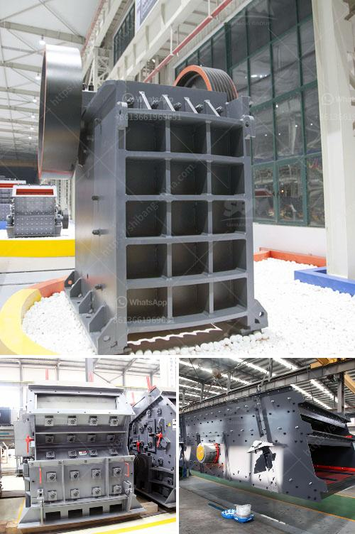

<h3>crushing plant flow sheet</h3>
A crushing plant flow sheet is a visual representation of the steps that occur during the crushing process. It shows the different components of the plant and how they interact with each other. The flow sheet is designed to capture all the material that passes through the plant and to provide a means of accurately measuring and reporting the quantity and quality of each product.

The first step in designing a crushing plant flow sheet is to understand the rock deposit and the requirements of the end product. The starting point for any flow sheet is the geology of the deposit. It is essential to have a clear understanding of the type and quality of rock being processed and the required end products. This information will help determine the layout and configuration of the plant.

The second step is to determine the crushing stages. This involves deciding the number and type of crushers needed to achieve the desired end product. The flow sheet should include a primary crusher, secondary crusher, and possibly a tertiary crusher. The primary crusher reduces the size of the rock from boulders to smaller rocks known as aggregate. The secondary crusher further breaks down the stone into smaller pieces suitable for the end product. Finally, the tertiary crusher produces the final product size required for market.

Once the crushing stages have been determined, the next step is to decide the material handling system. This includes determining how the material will be fed into the crushers and how the crushed material will be transported to the next stage. The flow sheet should include information on feeders, conveyors, screens, and other equipment used in the material handling process. It is important to ensure that the flow sheet provides a continuous flow of material with minimal downtime.

Another important aspect of the flow sheet is the sizing and classification of the products. This involves determining the size range and quality specifications of the final products. The flow sheet should include information on screens and classifiers used to separate the crushed material into different sizes. This information is crucial for reporting accurate product specifications and meeting customer requirements.

Lastly, the flow sheet should include information on the control and monitoring of the crushing plant. This includes details on the process control system and the instrumentation used to measure and record data. The flow sheet should also include information on the environmental controls implemented to ensure compliance with any regulatory requirements. This could include dust suppression systems, noise control measures, and water management systems.

In summary, a crushing plant flow sheet is a visual representation of the steps involved in the crushing process. It provides a comprehensive overview of the flow of material through the plant and highlights the different components and equipment used. The flow sheet is essential for accurately measuring and reporting the quantity and quality of the end products. It also ensures that the plant operates efficiently and complies with environmental regulations.
<h3>Contact us</h3><ul><li><strong>Whatsapp:&nbsp;<a href="https://wa.me/8613661969651">+8613661969651</a></strong></li><li><a href="https://swt.shibang-china.com/?git&amp;zhl&amp;crushing plant flow sheet"><strong>Online Service(chat now)</strong></a></li></ul><h3>Related</h3><ul><li><a href='gold mining equipment south africa for sale.md'>gold mining equipment south africa for sale</a></li><li><a href='ball mill feed spout sale.md'>ball mill feed spout sale</a></li><li><a href='how much is a crusher.md'>how much is a crusher</a></li><li><a href='cement plants in west bengal list.md'>cement plants in west bengal list</a></li><li><a href='mobile crusher in uae for sale.md'>mobile crusher in uae for sale</a></li></ul>