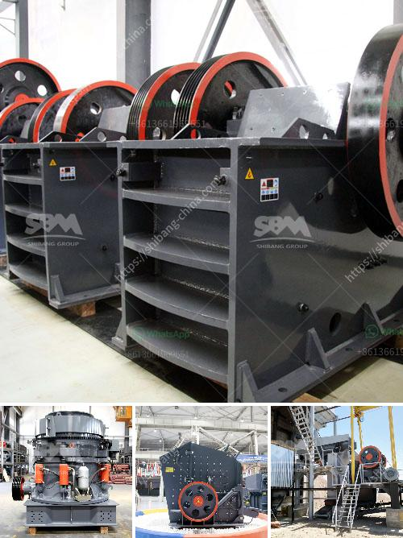

<h3>crushing plant for sale in</h3>
Crushing plants are a common sight in mining operations, quarries, and recycling facilities. They function to break down larger pieces of material into smaller, more manageable sizes for further processing. Whether used for ore extraction, construction waste recycling, or even demolition debris processing, crushing plants are crucial equipment that businesses rely on.

When it comes to purchasing a crushing plant, there are several factors that need to be considered. The primary consideration is the type of material that will be processed. Different crushing plants are designed to handle different types of materials, such as limestone, granite, or even concrete. It is essential to choose a plant that is suitable for the specific material to ensure efficient and effective processing.

Another important aspect to consider is the plant's capacity. The capacity of a crushing plant determines how much material it can handle within a given time frame. This factor is crucial for businesses that require large quantities of processed material. It is advisable to choose a plant with a capacity that matches or exceeds the required output.

Furthermore, the size and power requirements of the plant should also be taken into account. Some crushing plants may require a larger space for installation, while others can be compact and easily mobile. The power requirements will dictate the plant's energy source, whether it be electricity, diesel, or a combination of both.

Lastly, cost is always a significant consideration. Companies should carefully evaluate the initial purchase price, as well as the plant's operational costs, such as maintenance and energy consumption. It is essential to find a balance between the upfront investment and the long-term benefits the crushing plant will provide.

In conclusion, a crushing plant for sale offers businesses an opportunity to enhance their productivity and efficiency in material processing. However, careful consideration must be given to factors such as material type, capacity, size, power requirements, and cost. By selecting the right crushing plant, businesses can improve their operations and achieve their desired outcomes.
<h3>Contact us</h3><ul><li><strong>Whatsapp:&nbsp;<a href="https://wa.me/8613661969651">+8613661969651</a></strong></li><li><a href="https://swt.shibang-china.com/?git&amp;zhl&amp;crushing plant for sale in"><strong>Online Service(chat now)</strong></a></li></ul><h3>Related</h3><ul><li><a href='grinding machinery manufecture in ajmer.md'>grinding machinery manufecture in ajmer</a></li><li><a href='coal seal of coal pulverizer.md'>coal seal of coal pulverizer</a></li><li><a href='crusher manufacturing companies in hong kong.md'>crusher manufacturing companies in hong kong</a></li><li><a href='japan stone crushing machines.md'>japan stone crushing machines</a></li><li><a href='gold crusher and mill.md'>gold crusher and mill</a></li></ul>