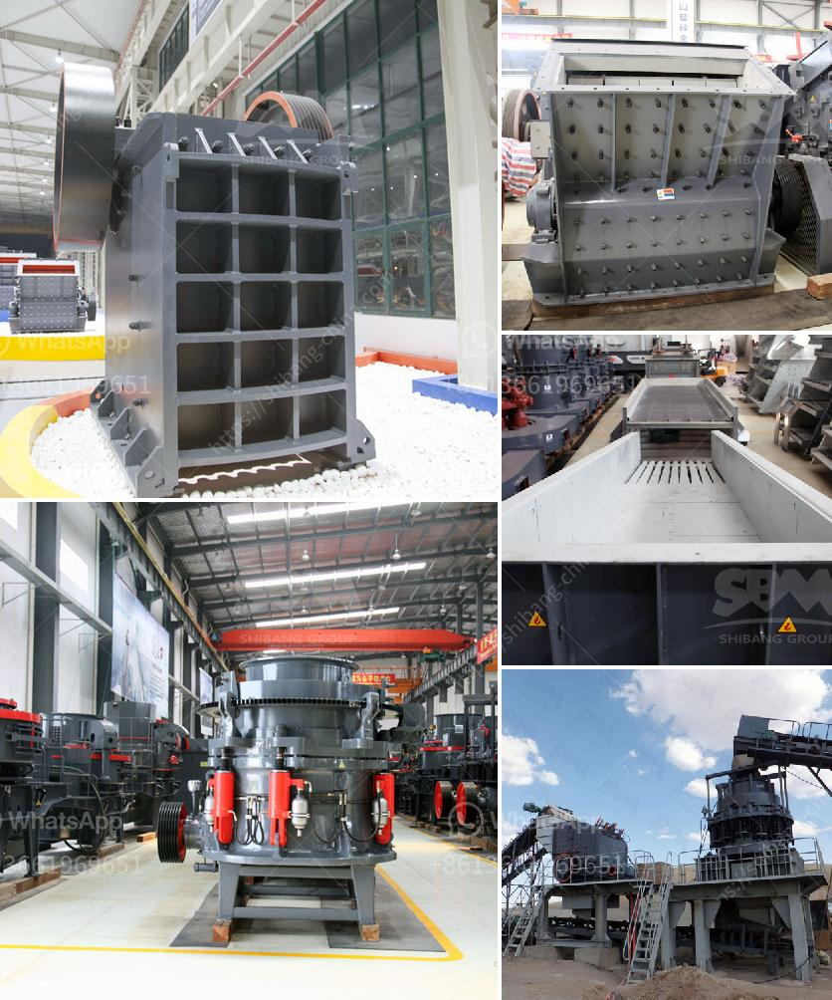

<h3>crushing plant in calatagan batangas</h3>
Calatagan, Batangas, is home to the pristine and breathtaking beaches that are perfect for a quick weekend getaway. But aside from its natural wonders, another highlight of this town is the presence of the crushing plant. Nestled in the rugged mountain ranges of Batangas, this plant is capable of extracting various mineral resources that are essential to our daily lives.

The crushing plant in Calatagan Batangas is widely known as a premier supplier of aggregates and other construction materials. With its top-notch machinery and equipment, this plant can produce different types of materials, such as crushed stones, sand, and gravel. These are essential substances used in various infrastructure projects, such as road construction and building foundations.

The crushing plant also plays a pivotal role in the mining industry. Through the plant's state-of-the-art technology, valuable minerals are extracted from raw materials. These minerals, such as limestone and volcanic rocks, are then meticulously processed to meet the quality standards required by different industries.

But it isn't just the economic aspect that makes the crushing plant in Calatagan Batangas significant. Its presence also contributes to the preservation of the environment. With careful resource management and adherence to environmental regulations, the plant ensures that its operations are sustainable and eco-friendly. The extraction and processing of materials are done in a responsible manner that minimizes ecological impact.

Moreover, the crushing plant understands the importance of community development. It actively participates in local initiatives, providing employment opportunities and supporting socio-economic programs. By doing so, they promote the overall progress of the community while maintaining a harmonious relationship with the locals.

Overall, the crushing plant in Calatagan Batangas is an essential facility that plays a vital role in the construction and mining industries. Its commitment to sustainability, community development, and high-quality production makes it an important contributor to the local economy. Whether it's for building infrastructure or extracting valuable minerals, this plant continues to cater to the growing demands of various industries, ensuring a sustainable future for both the community and the environment.
<h3>Contact us</h3><ul><li><strong>Whatsapp:&nbsp;<a href="https://wa.me/8613661969651">+8613661969651</a></strong></li><li><a href="https://swt.shibang-china.com/?git&amp;zhl&amp;crushing plant in calatagan batangas"><strong>Online Service(chat now)</strong></a></li></ul><h3>Related</h3><ul><li><a href='hammer mill for concentrate price.md'>hammer mill for concentrate price</a></li><li><a href='gypsum mining in garissa.md'>gypsum mining in garissa</a></li><li><a href='manufacturer of 30 80 mesh grinding plant.md'>manufacturer of 30 80 mesh grinding plant</a></li><li><a href='consultants to help to start a stone crusher.md'>consultants to help to start a stone crusher</a></li><li><a href='concrete crushing machine cost.md'>concrete crushing machine cost</a></li></ul>