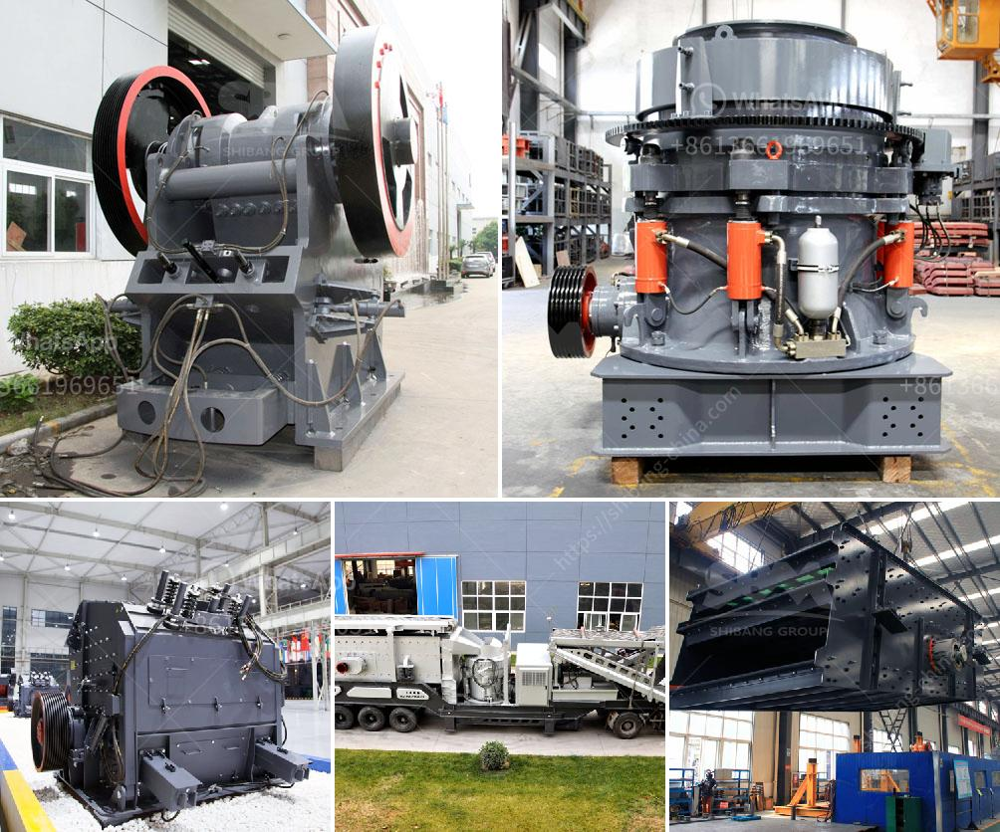

<h3>crushing plant in lahore</h3>
A crushing plant is a machine used to reduce the size of large rocks into smaller rocks, gravel, or rock dust. It is commonly used in the mining and construction industries for crushing different types of materials such as rocks, marbles, granite, iron ore, and copper ore. The crushing plant in Lahore is one of the most efficient and reliable plants in Pakistan.

With the increasing population and industrial development, the demand for construction materials is also on the rise. To meet this demand, the crushing plant in Lahore plays a vital role in supplying high-quality crushed stones to the construction industry. The plant is equipped with state-of-the-art machinery and technology, ensuring maximum productivity and efficiency.

The crushing plant in Lahore has a capacity of crushing 500 metric tons of rock per hour. This large facility ensures that the supply of crushed stones meets the demand of the construction industry. With such high capacity, the plant can also cater to large projects and provide a steady supply of crushed stones without any delay.

Not only does the crushing plant ensure a constant supply of crushed stones, but it also produces different sizes of stones for various construction purposes. The stones are sorted into different grades, ranging from the largest stones used for foundations to smaller stones used for road construction and landscaping.

Furthermore, the crushing plant in Lahore adheres to strict quality control measures to ensure that only high-quality crushed stones are produced. The stones undergo rigorous testing to meet the required specifications and standards set by the construction industry. This guarantees that the stones are durable and of superior quality, making them ideal for construction purposes.

In conclusion, the crushing plant in Lahore plays a significant role in the construction industry by providing a constant supply of high-quality crushed stones. With its high capacity and advanced technology, the plant ensures efficiency, reliability, and productivity. Moreover, strict quality control measures ensure that only the best stones are produced, meeting the demands and requirements of construction projects.
<h3>Contact us</h3><ul><li><strong>Whatsapp:&nbsp;<a href="https://wa.me/8613661969651">+8613661969651</a></strong></li><li><a href="https://swt.shibang-china.com/?git&amp;zhl&amp;crushing plant in lahore"><strong>Online Service(chat now)</strong></a></li></ul><h3>Related</h3><ul><li><a href='copper concentrate processing equipment.md'>copper concentrate processing equipment</a></li><li><a href='germany made gypsum block wall equipment.md'>germany made gypsum block wall equipment</a></li><li><a href='process of making quartz marble crusher.md'>process of making quartz marble crusher</a></li><li><a href='capacity 70 130tph impact crusher.md'>capacity 70 130tph impact crusher</a></li><li><a href='how to setup a stone quarry.md'>how to setup a stone quarry</a></li></ul>