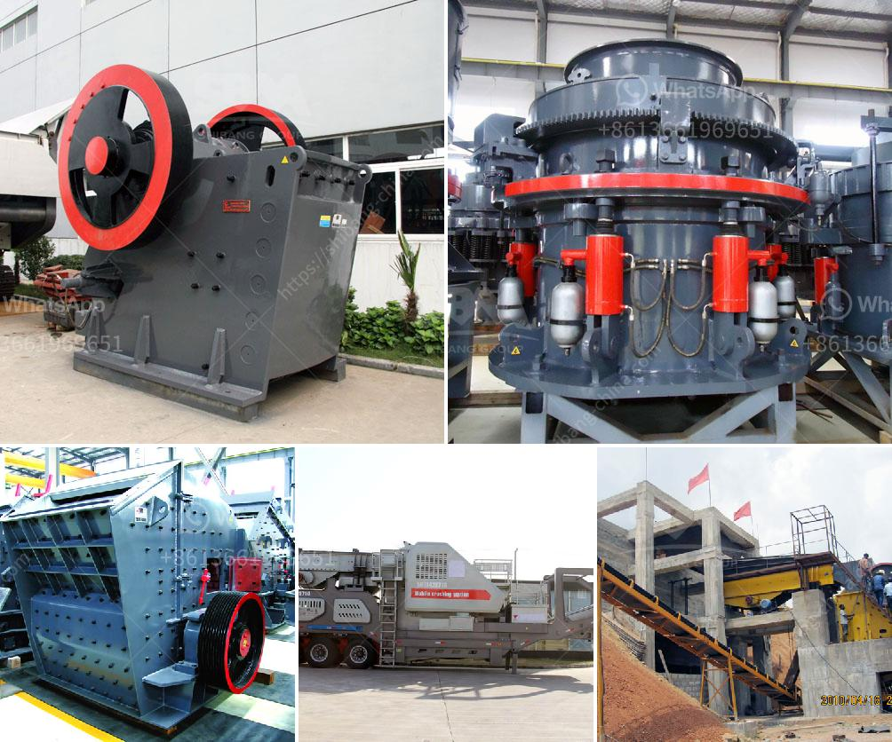

<h3>crushing plant in pangasinan</h3>
The province of Pangasinan, located in the northern part of the Philippines, is known for its rich agricultural lands and abundant natural resources. As an agricultural province, it is essential to have efficient and modern machinery to process and maximize the potential of these resources. One such machine is the crushing plant.

A crushing plant is a machine that reduces the size of materials such as rock and gravel. It helps to break down these materials into smaller, more manageable pieces, making them easier to transport or use for various purposes. In Pangasinan, the use of crushing plants has been instrumental in the growth and development of the agriculture and construction industries.

The primary function of a crushing plant is to produce aggregates for construction purposes. These aggregates are the raw materials used in the creation of concrete, asphalt, and other building materials. Without a reliable source of aggregates, construction projects in Pangasinan would be delayed or hindered.

Furthermore, a crushing plant also plays a significant role in the agricultural sector. Farmers in Pangasinan rely on crushed limestone or dolomite as soil amendments to improve the fertility of their farms. These crushed materials neutralize the acidity of the soil, making it more suitable for plant growth. Crushed limestone and dolomite also provide essential nutrients, such as calcium and magnesium, which are crucial for plant development.

In addition to its agricultural and construction uses, a crushing plant contributes to the development of the local economy. It provides job opportunities for skilled workers, such as machine operators, maintenance technicians, and truck drivers. The operation of a crushing plant also requires supporting industries, such as quarrying and mining, which create additional employment opportunities.

Moreover, the presence of a crushing plant in Pangasinan reduces the transportation cost of materials. Instead of sourcing aggregates or soil amendments from faraway locations, local farmers and construction companies can easily access the required materials. This not only saves time but also reduces fuel consumption and minimizes the carbon footprint associated with long-distance transportation.

While the benefits of a crushing plant in Pangasinan are evident, it is essential to consider environmental concerns. Proper maintenance and regulation of crushing plants are necessary to mitigate any negative impacts on the environment. Steps should be taken to control dust emissions, manage noise levels, and prevent pollution of nearby bodies of water. Implementing strict guidelines and conducting regular inspections can ensure that the operation of crushing plants aligns with environmental standards.

In conclusion, the presence of a crushing plant in Pangasinan has been a game-changer for the agriculture and construction industries. It has provided a reliable source of aggregates for construction projects and soil amendments for farmers. Moreover, it has stimulated economic growth by creating job opportunities and reducing transportation costs. However, it is crucial to balance these benefits with environmental considerations to ensure sustainable development in the province.
<h3>Contact us</h3><ul><li><strong>Whatsapp:&nbsp;<a href="https://wa.me/8613661969651">+8613661969651</a></strong></li><li><a href="https://swt.shibang-china.com/?git&amp;zhl&amp;crushing plant in pangasinan"><strong>Online Service(chat now)</strong></a></li></ul><h3>Related</h3><ul><li><a href='cement grinding mill price invest cost.md'>cement grinding mill price invest cost</a></li><li><a href='difference betweren jaw crusher and impact crusher.md'>difference betweren jaw crusher and impact crusher</a></li><li><a href='crushing machine south africa.md'>crushing machine south africa</a></li><li><a href='kaolin processing equipment manufacturers in germany.md'>kaolin processing equipment manufacturers in germany</a></li><li><a href='crushers for phonolite.md'>crushers for phonolite</a></li></ul>