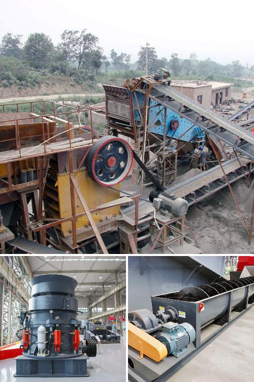

<h3>crushing plant manufacturers in china</h3>
If there is one word that sums up the infrastructure sector in recent years, it is "development." From roads and railways to bridges and airports, the growth and modernization of infrastructure in China have been staggering. Behind every successful infrastructure project in the country is a crushing plant manufacturer, which plays a crucial role in supplying the necessary equipment to support growth.

China has become a global powerhouse in infrastructure development. With the central government's emphasis on the construction industry as a key driver of economic growth, billions of dollars have been allocated for large-scale infrastructure projects. From building new highways, ports, and airports to expanding existing ones, the demand for high-quality aggregate materials has skyrocketed.

Cue the entry of crushing plant manufacturers. These companies specialize in designing and manufacturing equipment that crushes and screens different types of rocks, stones, and other materials into specific sizes, ensuring they are suitable for various construction applications. Crushing plants, which include jaw crushers, impact crushers, cone crushers, and vibrating screens, have become the backbone of infrastructure development in China.

One of the primary reasons for the success of crushing plant manufacturers in China is the nation's vast mineral resources. China is rich in minerals such as limestone, granite, and basalt, which are essential materials for infrastructure projects. These rocks need to be crushed into smaller sizes before they can be used in the construction industry.

Crushing plant manufacturers in China have the technology, resources, and expertise to produce high-quality aggregate materials. The crushing equipment they produce is heavy-duty, reliable, and efficient, making it possible to crush large quantities of rocks and stones in a short amount of time. This efficiency ensures that construction projects stay on schedule and meet their deadlines.

Moreover, crushing plant manufacturers in China have also made significant advancements in sustainability. With the growing concern for the environment, these manufacturers have developed crushing machines that consume less energy and produce less pollution. They also prioritize recycling and repurposing materials, ensuring that the construction industry becomes more environmentally friendly.

In recent years, crushing plant manufacturers in China have expanded their reach beyond the domestic market. The demand for high-quality aggregate materials has also surged in other countries undergoing infrastructure development, such as India, Indonesia, and Brazil. China's crushing plant manufacturers have seized this opportunity and exported their products to meet the global demand.

As crushing plant manufacturers continue to innovate and improve their products, the future of infrastructure development looks even brighter. The challenges posed by increasing urbanization and population growth call for more robust and sustainable infrastructure solutions. Crushing plants will play a crucial role in supplying the necessary materials to support this development.

In conclusion, crushing plant manufacturers in China are the unsung heroes of infrastructure development. Their ability to produce high-quality aggregate materials efficiently and sustainably has propelled China's infrastructure sector to new heights. These manufacturers have not only contributed to the nation's economic growth but have also exported their expertise to support global infrastructure development. With the demand for infrastructure set to continue, crushing plant manufacturers will remain essential in building the foundations of progress.
<h3>Contact us</h3><ul><li><strong>Whatsapp:&nbsp;<a href="https://wa.me/8613661969651">+8613661969651</a></strong></li><li><a href="https://swt.shibang-china.com/?git&amp;zhl&amp;crushing plant manufacturers in china"><strong>Online Service(chat now)</strong></a></li></ul><h3>Related</h3><ul><li><a href='limestone grinding machine.md'>limestone grinding machine</a></li><li><a href='silico manganese manufacturing equipment.md'>silico manganese manufacturing equipment</a></li><li><a href='cone crushers washing system.md'>cone crushers washing system</a></li><li><a href='crusher price in oman.md'>crusher price in oman</a></li><li><a href='high performance mobile crushing machine for sale.md'>high performance mobile crushing machine for sale</a></li></ul>