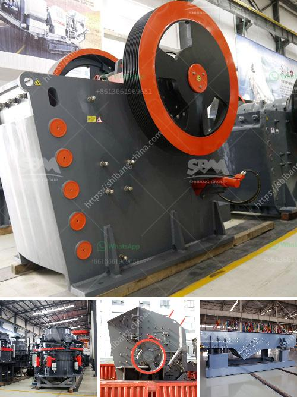

<h3>crushing plant manufacturers in kenya for quartz</h3>
Quartz is a hard, brittle mineral commonly found in igneous, metamorphic, and sedimentary rocks. It is widely used in various industries such as construction, ceramics, glass, electronics, and chemical manufacturing. Due to its high resistance to heat and corrosion, quartz is an ideal material for creating durable and high-performance products.

In Kenya, there is a growing demand for quartz products due to the country's thriving construction and infrastructure development projects. As a result, crushing plant manufacturers are expanding their production facilities and investing in new equipment to meet this demand.

One of the key players in the industry is Crushing Plant Manufacturers, an Italy-based company that specializes in the design, manufacture, and distribution of crushing machinery, screens, and feeders for the mining, quarrying, construction, recycling, and material handling industries.

Crushing Plant Manufacturers employs a team of skilled engineers and technicians who are experienced in dealing with various types of material, including quartz. They work closely with customers to understand their specific requirements and provide customized solutions that meet their needs. This approach ensures that customers receive high-quality, efficient, and cost-effective crushing equipment.

The company's crushing plant for quartz consists of jaw crushers, impact crushers, cone crushers, vibrating screens, belt conveyors, and control systems. Each machine is designed to achieve maximum productivity and high reduction ratio, ensuring that the final product is in line with the customer's specifications.

In addition to manufacturing equipment, Crushing Plant Manufacturers also provides comprehensive after-sales support and technical assistance. Their team of experts is available to guide customers through the installation process, train personnel on equipment operation and maintenance, and provide prompt assistance in case of any issues or breakdowns.

Moreover, Crushing Plant Manufacturers in Kenya for quartz focuses on sustainability and environmental protection. They strive to minimize the impact of their operations through efficient energy usage, waste management, and recycling initiatives. By adopting green practices, the company ensures that its crushing plants are not only beneficial to customers but also contribute to the overall well-being of the environment.

Furthermore, Crushing Plant Manufacturers in Kenya is committed to promoting local employment and economic growth. They actively source raw materials and labor locally whenever possible, creating job opportunities for the local population and supporting the development of the country's economy.

In conclusion, Crushing Plant Manufacturers in Kenya for quartz play a vital role in meeting the growing demand for quartz products in the country. With their expertise, advanced technology, and focus on sustainability, they provide customers with high-quality crushing equipment that not only meets their needs but also contributes to the economic and environmental well-being of Kenya.
<h3>Contact us</h3><ul><li><strong>Whatsapp:&nbsp;<a href="https://wa.me/8613661969651">+8613661969651</a></strong></li><li><a href="https://swt.shibang-china.com/?git&amp;zhl&amp;crushing plant manufacturers in kenya for quartz"><strong>Online Service(chat now)</strong></a></li></ul><h3>Related</h3><ul><li><a href='types of belt conveyors used in cement industries.md'>types of belt conveyors used in cement industries</a></li><li><a href='stone crushing equipment available.md'>stone crushing equipment available</a></li><li><a href='china make vertical roller mill.md'>china make vertical roller mill</a></li><li><a href='how much is earned in the stone crusher.md'>how much is earned in the stone crusher</a></li><li><a href='limestone crusher hammers.md'>limestone crusher hammers</a></li></ul>