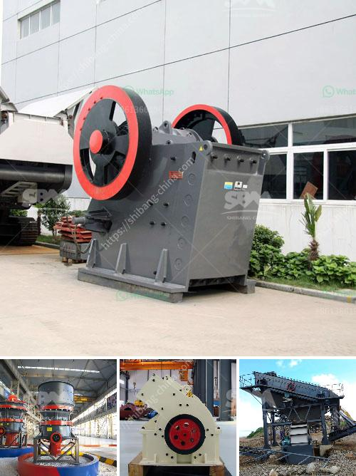

<h3>crushing plant supplier</h3>
When it comes to constructing a new facility or expanding an existing one, selecting the right crushing plant supplier is essential. A crushing plant is a major investment and requires careful consideration to ensure that the equipment is reliable, efficient, and meets the specific needs of the project.

One of the key aspects to consider when choosing a crushing plant supplier is the type of equipment they offer. Different projects require different types of crushers, screens, and conveyors. For instance, if the project requires producing aggregates for road construction, a supplier that specializes in cone crushers and impact crushers would be a good choice. On the other hand, if the project involves recycling concrete, a supplier that offers a variety of jaw crushers and mobile crushers may be more suitable.

Another important factor to consider is the quality and reliability of the equipment. A reputable crushing plant supplier should provide equipment that is built with high-quality materials, precision engineering, and advanced technology. This ensures that the equipment can withstand heavy-duty usage and deliver consistent performance over a long period of time.

Furthermore, it is crucial to evaluate the supplier's after-sales support. Equipment maintenance and repair are inevitable, and a reliable supplier should offer comprehensive support to keep the crushing plant running smoothly. This can include providing spare parts, technical assistance, and on-site training for the plant operators.

Cost is also a significant consideration when choosing a crushing plant supplier. While it is tempting to go for the supplier with the lowest price, it is important to assess the overall value for money. A supplier that offers a competitive price while delivering high-quality equipment and excellent after-sales support may be a better choice in the long run.

In addition to the above factors, it is advisable to do some research and read reviews about different crushing plant suppliers. Customer reviews and testimonials can provide valuable insights into the supplier's reputation, customer satisfaction, and overall performance.

One of the reputed crushing plant suppliers in the industry is ABC Crushing Solutions. With years of experience and a wide range of high-quality equipment, they excel in providing efficient and reliable crushing solutions for various projects. They offer a comprehensive range of crushers, screens, and conveyors and have a strong commitment to customer satisfaction. ABC Crushing Solutions also provides excellent after-sales support, including spare parts and technical assistance.

In conclusion, selecting the right crushing plant supplier is crucial for the success of any construction project. It is essential to consider the type of equipment, quality and reliability, after-sales support, and cost when making the decision. By carefully evaluating different suppliers and considering their reputation and customer reviews, you can ensure that you choose a reliable supplier that meets your project requirements.
<h3>Contact us</h3><ul><li><strong>Whatsapp:&nbsp;<a href="https://wa.me/8613661969651">+8613661969651</a></strong></li><li><a href="https://swt.shibang-china.com/?git&amp;zhl&amp;crushing plant supplier"><strong>Online Service(chat now)</strong></a></li></ul><h3>Related</h3><ul><li><a href='used sand wash plant for sale.md'>used sand wash plant for sale</a></li><li><a href='stone crushing equipment available.md'>stone crushing equipment available</a></li><li><a href='jaw crusher manufacturers.md'>jaw crusher manufacturers</a></li><li><a href='how does a stone crushing plant work.md'>how does a stone crushing plant work</a></li><li><a href='malaysia mineral ball mill.md'>malaysia mineral ball mill</a></li></ul>