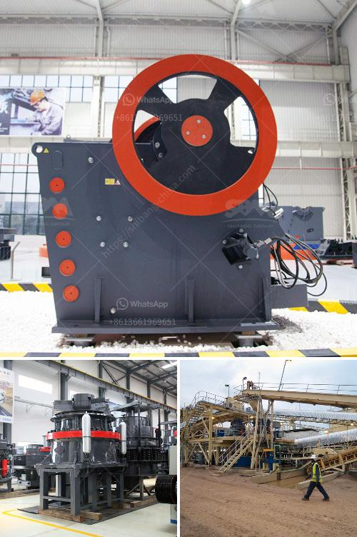

<h3>crushing processing equipment</h3>
Crushing processing equipment is an integral part of the mining and aggregate industries, ensuring the fragmentation and reduction of materials for extraction purposes. Crushing equipment plays a vital role in enhancing the efficiency of production processes and improving overall productivity.

One of the key benefits of crushing processing equipment is its ability to break down large rocks into smaller, more manageable sizes. This fragmentation process allows for easier transportation and handling of materials, reducing logistical challenges and costs. By reducing material sizes, crushing equipment also helps to optimize downstream processes, such as milling and refining.

A variety of crushing processing equipment is available in the market, with different capabilities and features to suit specific industry requirements. Jaw crushers, cone crushers, impact crushers, and gyratory crushers are some of the commonly used types of crushing equipment. Each type serves a distinct purpose in the overall crushing process, with varying capacities and power requirements.

In addition to size reduction, crushing processing equipment also helps in the liberation of valuable minerals from ore. This is achieved by applying mechanical forces to the material, causing it to break apart and release the desired minerals. The extraction of minerals from ore is a crucial step in mining operations, and crushing equipment ensures the effective separation of minerals from waste materials.

Efficiency and durability are two crucial factors that a good quality crushing processing equipment must possess. High-quality equipment can significantly reduce downtime, maintenance costs, and the overall operational costs. Investing in reliable crushing equipment ensures a smooth production flow and higher profitability for mining and aggregate companies.

Crushing processing equipment has witnessed significant advancements in recent years, with the incorporation of innovative technologies like automation, remote monitoring, and data analytics. These advancements have improved operational efficiency, safety, and productivity. With real-time monitoring and data-driven insights, operators can make informed decisions to optimize the performance of the equipment and minimize potential issues.

In conclusion, crushing processing equipment plays a critical role in the mining and aggregate industries by fragmenting materials and liberating valuable minerals from ore. Its ability to increase efficiency, reduce costs, and improve productivity makes it an essential component of any production process. Choosing the right equipment with the latest technological advancements ensures optimal performance and contributes to the success of mining and aggregate operations.
<h3>Contact us</h3><ul><li><strong>Whatsapp:&nbsp;<a href="https://wa.me/8613661969651">+8613661969651</a></strong></li><li><a href="https://swt.shibang-china.com/?git&amp;zhl&amp;crushing processing equipment"><strong>Online Service(chat now)</strong></a></li></ul><h3>Related</h3><ul><li><a href='used machines philippines ball mill.md'>used machines philippines ball mill</a></li><li><a href='drywall recycling machine sales.md'>drywall recycling machine sales</a></li><li><a href='used raymond mill for sale in india.md'>used raymond mill for sale in india</a></li><li><a href='crusher price in nepal.md'>crusher price in nepal</a></li><li><a href='how to identify rear roll in the two roll mill.md'>how to identify rear roll in the two roll mill</a></li></ul>