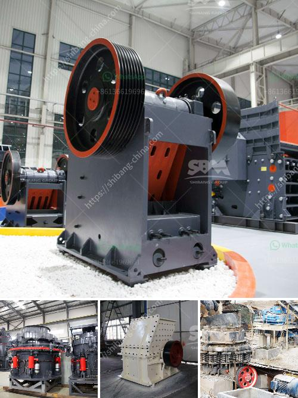

<h3>cube crushing machine</h3>
Concrete or cement is a building material that has been used for centuries. However, the process to produce this material is labor-intensive and involves many steps, including mixing, molding, curing, and drying. These steps require large amounts of energy and time, making the production process expensive and time-consuming.

To address this issue, cube crushing machines have been developed for efficient and fast crushing of concrete cubes. These machines have revolutionized the construction industry by providing an automated solution to the time-consuming task of crushing concrete cubes manually. 

Cube crushing machines are generally compact and portable, making it easy for them to be moved and used across various construction sites. These machines consist of a hydraulic system that applies a compressive force to cubes with immense pressure. This force is adjustable, allowing the operator to control the desired strength of crushed concrete cubes. 

The crushed concrete is then transferred to a waste recycling plant, where it is further processed and transformed into fine particles. These particles can be used as a substitute for natural sands or be mixed with cement to create new concrete. The cube crushing machine eliminates the cumbersome task of manually crushing cubes and frees up valuable time for other construction activities.

The cube crushing machine is manufactured with quality materials and advanced technology. It has a long service life and requires minimal maintenance, saving time and effort for users. The machine also features a user-friendly control panel for easy operation.

Cube crushing machines are highly efficient, generating fine particles that enhance the durability and strength of concrete. These particles can be used in a wide range of applications, including road construction, manufacturing precast concrete products, and building foundations. By using crushed concrete cubes, construction projects can be completed faster and more cost-effectively.

In conclusion, cube crushing machines are essential for the construction industry to streamline the production process. They offer an automated and efficient solution to crushing concrete cubes, saving time, energy, and costs. With their ability to generate fine particles, these machines contribute to the development of durable and sustainable construction materials.
<h3>Contact us</h3><ul><li><strong>Whatsapp:&nbsp;<a href="https://wa.me/8613661969651">+8613661969651</a></strong></li><li><a href="https://swt.shibang-china.com/?git&amp;zhl&amp;cube crushing machine"><strong>Online Service(chat now)</strong></a></li></ul><h3>Related</h3><ul><li><a href='roller mill for sale kenya.md'>roller mill for sale kenya</a></li><li><a href='cement plant machine.md'>cement plant machine</a></li><li><a href='crushers made in south philippines.md'>crushers made in south philippines</a></li><li><a href='ball mill ball mill factories.md'>ball mill ball mill factories</a></li><li><a href='dolomite rock crusher.md'>dolomite rock crusher</a></li></ul>