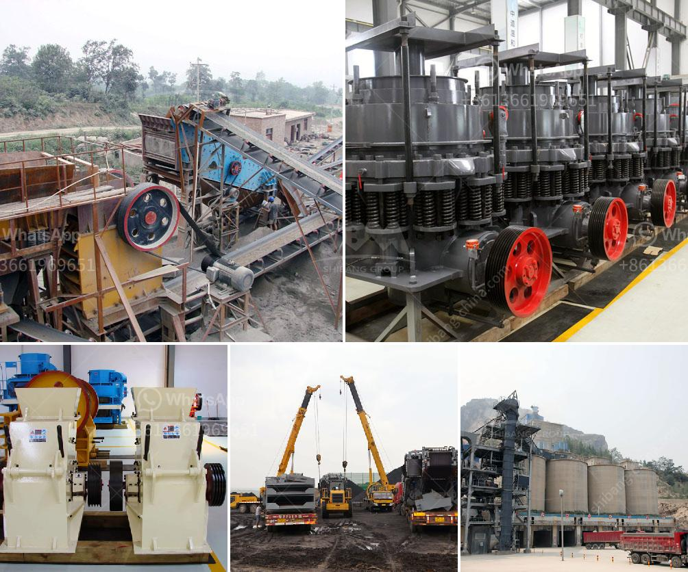

<h3>denver roll crusher for sale</h3>
Denver roll crusher, also known as roller crusher, belongs to traditional crushing equipment. It is mainly used for fine processing of material particles. As the main working part, the two cylindrical rollers rotate oppositely to achieve the purpose of crushing. Due to its remarkable features, this machine has been widely used in various fields.

The Denver roll crusher is equipped with two robust crushing rolls that rotate towards each other to crush materials. The application of the force between the two rolls breaks the particles as they pass through the gap. As a result, the crushed material is discharged as soon as it reaches the desired size.

One of the main advantages of the Denver roll crusher is its ability to produce a narrow particle size distribution, which is important for creating a uniform product. Additionally, the machine can handle a wide range of materials, including brittle minerals, such as coal, limestone, and others.

Moreover, the Denver roll crusher is easy to operate and maintain. Its rugged construction ensures reliable performance, even under harsh operating conditions. The machine is also equipped with safety features to prevent accidents and protect the operator.

For those looking to purchase a Denver roll crusher, there are various options available in the market. Many reputable dealers offer both new and used machines, allowing customers to choose the one that suits their specific requirements and budget.

In conclusion, the Denver roll crusher is a reliable and versatile machine that is suitable for various applications. Its ability to produce a narrow particle size distribution and handle different materials makes it a valuable asset in industries such as mining, quarrying, and construction. With its easy operation and maintenance, this equipment is an excellent investment for those seeking efficient and effective crushing solutions.
<h3>Contact us</h3><ul><li><strong>Whatsapp:&nbsp;<a href="https://wa.me/8613661969651">+8613661969651</a></strong></li><li><a href="https://swt.shibang-china.com/?git&amp;zhl&amp;denver roll crusher for sale"><strong>Online Service(chat now)</strong></a></li></ul><h3>Related</h3><ul><li><a href='stone crusher machine price in usa.md'>stone crusher machine price in usa</a></li><li><a href='stone crusher plant for sale philippines.md'>stone crusher plant for sale philippines</a></li><li><a href='grinding machine its operation principle.md'>grinding machine its operation principle</a></li><li><a href='cost of a conveyor belt systems for mining.md'>cost of a conveyor belt systems for mining</a></li><li><a href='business plan of stone crushing companies.md'>business plan of stone crushing companies</a></li></ul>