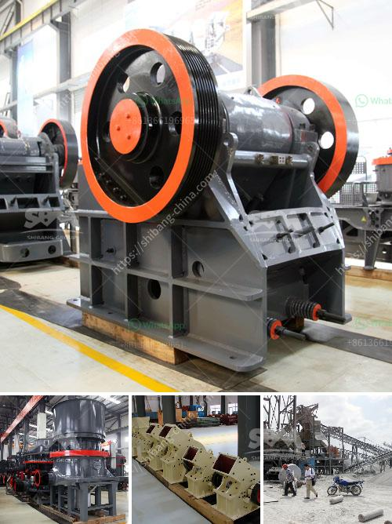

<h3>depreciacion de molino industrial</h3>
En el ámbito industrial, los molinos son máquinas indispensables para diversos procesos de producción. Estos equipos son utilizados en diferentes industrias, como la alimenticia, la farmacéutica, la química, entre otras.

Sin embargo, al igual que cualquier otro activo en una empresa, los molinos industriales están sujetos a un proceso de depreciación. La depreciación de un molino industrial es la disminución progresiva de su valor a lo largo del tiempo debido al desgaste y envejecimiento que experimenta.

Existen diferentes métodos para calcular la depreciación de un molino industrial, siendo el más común el método de línea recta. Este método considera que el valor depreciable del activo se distribuye de manera igual durante su vida útil. Por ejemplo, si un molino industrial tiene un valor de $10,000 y tiene una vida útil estimada de 10 años, su depreciación anual sería de $1,000.

La depreciación de un molino industrial es importante de considerar por diversas razones. En primer lugar, permite a la empresa tener un registro preciso de la vida útil y el valor actual de sus activos. Esto es fundamental para llevar un control financiero adecuado y realizar decisiones estratégicas.

La depreciación también tiene implicaciones fiscales. En muchos países, los activos depreciados pueden ser deducidos como gastos durante el periodo de depreciación. Esto reduce la carga impositiva de la empresa y puede tener un impacto significativo en sus estados financieros.

Además, la depreciación de un molino industrial también está relacionada con su mantenimiento y reparación. A medida que el equipo envejece, es más probable que necesite reparaciones y sustitución de partes. Estas tareas no solo implican un costo adicional, sino también una posible disminución en la eficiencia y productividad del molino.

Es importante destacar que una depreciación adecuada de un molino industrial no solo se basa en el tiempo, sino también en factores como el uso, la calidad de los materiales, las condiciones de trabajo y el mantenimiento realizado. Todos estos elementos pueden acelerar o ralentizar el proceso de depreciación.

Para llevar a cabo una depreciación adecuada de un molino industrial, es fundamental contar con un registro preciso de los costos de adquisición, vida útil estimada y valor residual. También es recomendable contar con profesionales especializados que ayuden en el cálculo e implementación de este proceso.

En conclusión, la depreciación de un molino industrial es un aspecto importante a considerar en cualquier empresa que utilice este equipo. No solo permite llevar un control financiero adecuado, sino que también tiene implicaciones fiscales y está relacionada con el mantenimiento y reparación del molino. Por lo tanto, es fundamental realizar un cálculo preciso y tener en cuenta los factores que pueden acelerar o ralentizar el proceso de depreciación. El adecuado manejo de la depreciación será clave para garantizar la eficiencia y productividad del molino a lo largo de su vida útil.
<h3>Contact us</h3><ul><li><strong>Whatsapp:&nbsp;<a href="https://wa.me/8613661969651">+8613661969651</a></strong></li><li><a href="https://swt.shibang-china.com/?git&amp;zhl&amp;depreciacion de molino industrial"><strong>Online Service(chat now)</strong></a></li></ul><h3>Related</h3><ul><li><a href='size to a jaw crusher and cone crusher.md'>size to a jaw crusher and cone crusher</a></li><li><a href='quarry machine manufacturing company in malaysia.md'>quarry machine manufacturing company in malaysia</a></li><li><a href='cement clinker grinding mill.md'>cement clinker grinding mill</a></li><li><a href='grinding and milling machines.md'>grinding and milling machines</a></li><li><a href='process flow of bajri washing plant.md'>process flow of bajri washing plant</a></li></ul>