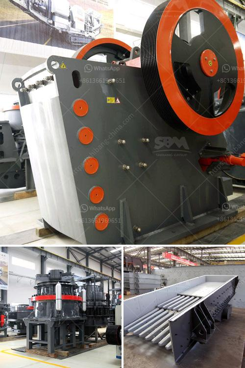

<h3>description of a 5x6 jaw crusher</h3>
A jaw crusher is a mechanical device used to break large chunks of rocks into smaller pieces, thereby facilitating the transportation and subsequent processing of the extracted material in various industries. It is commonly used in the mining and construction industries for crushing different types of rocks such as granite, limestone, concrete, and even asphalt.

One popular type of jaw crusher is the 5x6 jaw crusher, which is designed to crush larger rocks effectively. The size of the jaw crusher refers to the dimensions of the jaws and determines the maximum capacity of the crushing chamber. In the case of the 5x6 jaw crusher, the size of the jaws is 5 inches by 6 inches, which indicates that it can accept rocks up to 5 inches in diameter.

The 5x6 jaw crusher operates through a motor that drives a belt, causing the jaws to move back and forth in a rocking motion. The rocks are fed into the crushing chamber through an opening at the top of the crusher. As the jaws move, they apply pressure to the rocks, gradually breaking them into smaller pieces.

With a 5x6 jaw crusher, the maximum feed size can range from 4 to 6 inches. This allows for a variety of rock sizes to be processed efficiently. The crushing capacity of the 5x6 jaw crusher also depends on the settings of the jaws, which can be adjusted to regulate the size of the output material. Typically, the crusher produces material that ranges from 1 inch to smaller sizes.

The 5x6 jaw crusher is often used in small-scale mining operations or for testing purposes. It is known for its simplicity and ease of use, making it suitable for both experienced operators and beginners in the industry. The compact size of the crusher also makes it easier to transport and install in different work environments.

In terms of maintenance, the 5x6 jaw crusher is designed with simplicity in mind. The bearings and other parts can be easily accessed for inspection or replacement. Regular lubrication and cleaning are essential to ensure the smooth operation of the crusher and extend its lifespan.

In conclusion, the 5x6 jaw crusher is a reliable and efficient crushing device that can process rocks of various sizes. Its simplicity, compactness, and ease of use make it a popular choice among mining and construction professionals. Whether used in small-scale mining operations or for testing purposes, the 5x6 jaw crusher delivers consistent performance and effective crushing results.
<h3>Contact us</h3><ul><li><strong>Whatsapp:&nbsp;<a href="https://wa.me/8613661969651">+8613661969651</a></strong></li><li><a href="https://swt.shibang-china.com/?git&amp;zhl&amp;description of a 5x6 jaw crusher"><strong>Online Service(chat now)</strong></a></li></ul><h3>Related</h3><ul><li><a href='screen crusher for sale.md'>screen crusher for sale</a></li><li><a href='how to control partials size in vertical hammer mill.md'>how to control partials size in vertical hammer mill</a></li><li><a href='washing machine for small scale mining in ghana.md'>washing machine for small scale mining in ghana</a></li><li><a href='cement factories equipment in south africa.md'>cement factories equipment in south africa</a></li><li><a href='coal mill hydraulic system principles.md'>coal mill hydraulic system principles</a></li></ul>