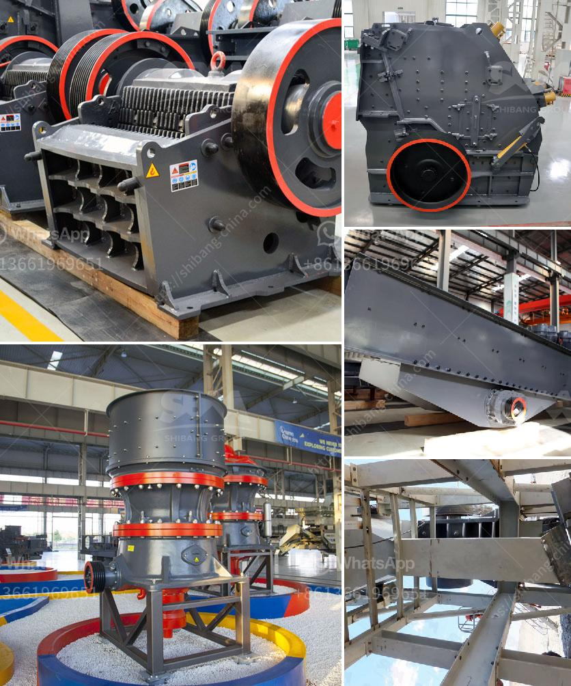

<h3>design and sizing of a gold processing plant pdf</h3>
Gold mining operations are becoming increasingly complex. As new discoveries are made and environmental regulations become more stringent, the design and sizing of a gold processing plant must be carefully considered.

The key factors that will determine the overall design and sizing of the processing plant include the grade and tonnage of the ore, the geology of the deposit, available infrastructure, and the desired metallurgical recovery.

The first step in designing a gold processing plant is to understand the metallurgical characteristics of the ore. This involves determining the gold grade, as well as the distribution and liberation of the gold particles. This information is crucial in determining the most appropriate processing method and equipment.

The next consideration is the tonnage of the ore to be processed. This will dictate the scale of the processing plant and the size of the equipment required. It is important to strike a balance between processing efficiency and capital investment. A plant that is too small may not be able to effectively process the ore, while a plant that is too large may result in unnecessary operating costs.

The geology of the deposit also plays a significant role in plant design. The type and characteristics of the host rock, as well as the presence of other minerals and impurities, can impact the processing circuit. For example, if the ore contains high levels of sulfides, additional steps may be required to ensure the sulfide minerals are adequately processed and the gold is efficiently recovered.

Infrastructure considerations are another important factor. A gold processing plant requires access to utilities and transportation corridors. This may involve constructing new roads or rail links, upgrading existing infrastructure, or locating the plant in close proximity to power and water sources. The availability of skilled labor in the area should also be assessed.

Finally, the desired metallurgical recovery is crucial in designing the processing plant. This refers to the percentage of gold that can be effectively recovered from the ore. The recovery rate will influence the selection of processing equipment, as well as the overall design of the plant.

Once these factors have been considered, the design and sizing of the gold processing plant can begin. This typically involves the development of a process flow diagram, which outlines the various steps and equipment involved in the processing of the ore. The diagram serves as a blueprint for the construction and operation of the plant.

In conclusion, the design and sizing of a gold processing plant is a complex task that requires careful consideration of several factors. The grade and tonnage of the ore, the geology of the deposit, available infrastructure, and the desired metallurgical recovery all play a role in determining the optimal design. By taking these factors into account, mining companies can ensure the efficient and environmentally responsible processing of gold ore.
<h3>Contact us</h3><ul><li><strong>Whatsapp:&nbsp;<a href="https://wa.me/8613661969651">+8613661969651</a></strong></li><li><a href="https://swt.shibang-china.com/?git&amp;zhl&amp;design and sizing of a gold processing plant pdf"><strong>Online Service(chat now)</strong></a></li></ul><h3>Related</h3><ul><li><a href='crushing plant flow sheet.md'>crushing plant flow sheet</a></li><li><a href='small scale prospector ore crusher.md'>small scale prospector ore crusher</a></li><li><a href='small portable rock crusher for sale africa.md'>small portable rock crusher for sale africa</a></li><li><a href='rental of portable crusher in saudi arabia.md'>rental of portable crusher in saudi arabia</a></li><li><a href='conveyor belts price.md'>conveyor belts price</a></li></ul>