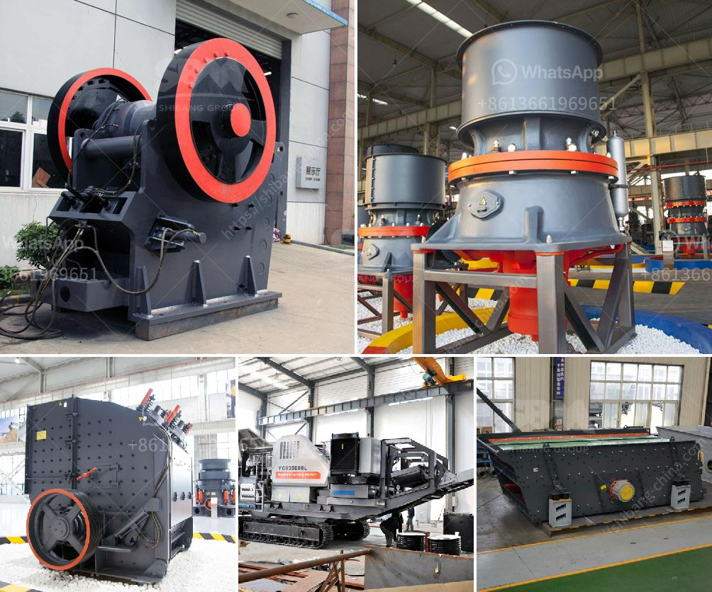

<h3>diagram of coal conveyor tunnel</h3>
A diagram of a coal conveyor tunnel depicts the various components involved in the transportation process of coal from the extraction point to the final storage destination. These diagrams are also known as Coal Handling Plant (CHP) diagrams, coal handling diagrams, or coal handling and preparation plant (CHPP) diagrams.

The primary purpose of a coal conveyor tunnel is to transport coal from the mining site to the storage facility. The diagram showcases the conveyor belts that carry the coal from the extraction point to the loading point. It also demonstrates the mechanisms used to control the flow of coal and ensure a smooth and efficient transportation process.

At the extraction point, the diagram portrays the coal being loaded onto the conveyor belt. This may involve the use of loaders, bucket elevators, or scrapers to transfer the coal onto the conveyor system. The conveyors themselves consist of a series of interconnected belts that are powered by motors. These motors provide the necessary rotational force to move the belts and transport the coal.

To enhance the efficiency of the coal conveyor tunnel, various devices are incorporated into the system. One such device is the coal sampler, which is used to collect coal samples for quality testing. These samples provide important information about the composition and quality of the coal, allowing for proper sorting and identification.

Another important component depicted in the diagram is the coal crusher. The coal crusher is responsible for breaking down the larger coal blocks into smaller pieces that can be more easily handled. This crushing process increases the surface area of the coal, making it easier to transport and ensuring a more consistent quality.

Throughout the conveyor tunnel, various sensors and detectors are strategically placed to monitor the coal's flow and quality. These devices include level sensors, which measure the amount of coal on the conveyor belt, and metal detectors, which identify and remove any metallic debris that may contaminate the coal.

The diagram also illustrates the presence of coal storage areas within the conveyor tunnel. These storage areas are designed to hold the coal temporarily before it is further processed or transported to its final destination. Adequate storage capacity is crucial to ensure an uninterrupted flow of coal and to account for any fluctuations in demand.

Additionally, the diagram may include ancillary equipment such as dust collectors and ventilation systems. These components are essential for maintaining a safe and clean working environment, as coal dust can pose health hazards and contribute to fires and explosions.

In conclusion, a diagram of a coal conveyor tunnel provides a visual representation of the various components involved in the transportation of coal. From the extraction point to the storage destination, the diagram showcases the conveyor belts, crushers, sensors, and storage areas that make up an efficient coal handling system. By following these diagrams, operators can ensure the smooth and safe transportation of coal, essential for meeting energy demands worldwide.
<h3>Contact us</h3><ul><li><strong>Whatsapp:&nbsp;<a href="https://wa.me/8613661969651">+8613661969651</a></strong></li><li><a href="https://swt.shibang-china.com/?git&amp;zhl&amp;diagram of coal conveyor tunnel"><strong>Online Service(chat now)</strong></a></li></ul><h3>Related</h3><ul><li><a href='stone crusher of mandibila in argentina.md'>stone crusher of mandibila in argentina</a></li><li><a href='stone crushing and screening plant.md'>stone crushing and screening plant</a></li><li><a href='plamnta mobile stone crusher.md'>plamnta mobile stone crusher</a></li><li><a href='basalt processing line.md'>basalt processing line</a></li><li><a href='basalt crusher plant price.md'>basalt crusher plant price</a></li></ul>