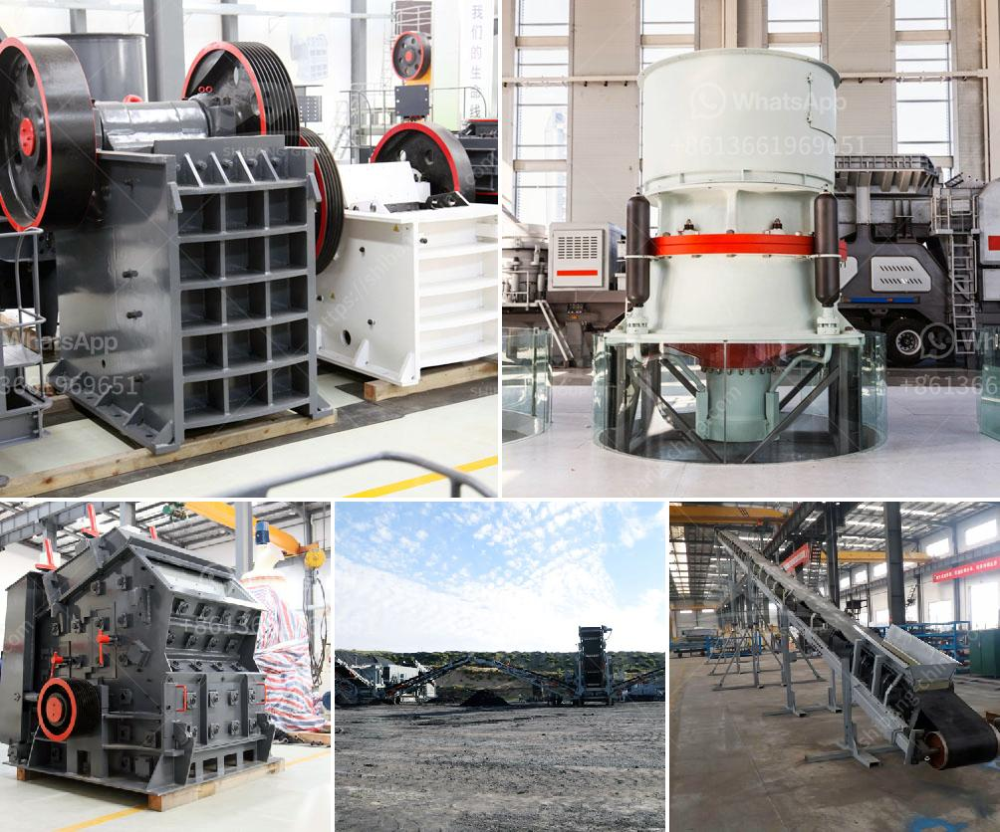

<h3>diagram of hammer mill</h3>
A diagram of a hammer mill can be explained in various forms, but essentially, it is the basic machinery that converts raw materials into powdered material. The mechanism of a hammer mill is very simple, yet efficient. The main feature of it is its rotor, which consists of a series of hammers attached on a rotating shaft. These hammers collide with the raw material, causing it to be crushed into smaller particles.

The diagram of a hammer mill typically consists of several components. Firstly, there is the rotor (depicted by a horizontal shaft with several hammers attached to it). On the left side of the diagram, there is a hopper for the raw material, and at the right side, there is an outlet to collect the crushed material. Some hammer mills may also have a screen at the bottom to control the particle size of the final product.

When the raw material is fed into the hammer mill through the hopper, it falls onto the rotor. As the rotor spins, the hammers rotate around the shaft and collide with the material. This impact causes the material to be shattered, which further breaks it down into smaller particles. The smaller particles pass through the screen at the bottom and are collected while the larger particles continue to be crushed by the rotating hammers.

The diagram of a hammer mill illustrates the basic principle of its operation. It consists of four main parts: the feed mechanism, the rotor, the discharge outlet, and the screen. The feed mechanism sends the raw material into the crushing chamber. The rotor rotates at high speed, allowing the hammers to strike the material. The crushed material is then discharged through the outlet, with the desired particle size being determined by the screen.

Hammer mills are widely used in various industries for grinding and crushing purposes. They are commonly used in the agricultural, pharmaceutical, and chemical industries, among others. Besides its simplicity, hammer mills are known for their versatility, allowing different materials to be processed, such as grains, minerals, and even plastics.

In conclusion, a diagram of a hammer mill provides a visual representation of its main components and the process by which raw materials are crushed and transformed into powdered material. By understanding its mechanics, one can appreciate the efficiency and versatility of this machinery in various industries.
<h3>Contact us</h3><ul><li><strong>Whatsapp:&nbsp;<a href="https://wa.me/8613661969651">+8613661969651</a></strong></li><li><a href="https://swt.shibang-china.com/?git&amp;zhl&amp;diagram of hammer mill"><strong>Online Service(chat now)</strong></a></li></ul><h3>Related</h3><ul><li><a href='crushing machine in ghana.md'>crushing machine in ghana</a></li><li><a href='small hammer crusher.md'>small hammer crusher</a></li><li><a href='cheap concrete crusher sale kenya.md'>cheap concrete crusher sale kenya</a></li><li><a href='portable crushing plant.md'>portable crushing plant</a></li><li><a href='dolomite refractory bricks process.md'>dolomite refractory bricks process</a></li></ul>