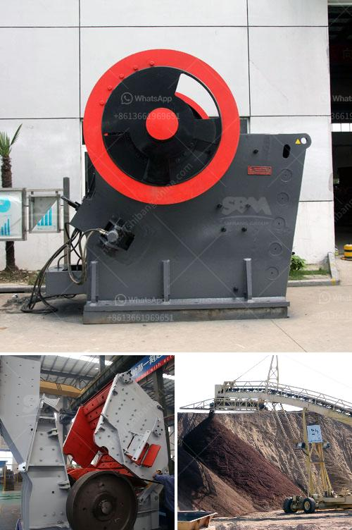

<h3>diesel engine small stone crusher</h3>
A diesel engine small stone crusher, also called diesel engine rock crusher, is used for crushing stones into small size or powder. The small diesel engine crusher is mainly used in some places where there is no electricity or it is inconvenient to bring electricity. The diesel engine stone crusher can do the middle or fine crushing for every kind of rocks and stones, featuring in the high working efficiency, strong crushing capacity and low fuel consumption. The diesel engine small stone crusher is mainly used in some places that don't have enough electricity or without electricity. They can do the middle or fine crushing for every kind of rocks and stones.

This kind of diesel engine small stone crusher is in compact structure, easy usage and simple operation. We also can do portable (mobile) ones as clients' request. It does not need electricity, only driven by diesel engine and it is easy to transport and to operate. Diesel engine stone crusher can commonly alias: the crusher, jaw crusher, stone crusher, sand making machine, crusher (Rock Crusher). The diesel engine small stone crusher has come out of the factory and been put into production rapidly. Therefore, our diesel engine small stone crusher has reasonable price, great crushing efficiency, low wearing cost, long service life and other benefits. At the same time, it has the advantages of easy transportation and installation, convenient maintenance and adjustment, and excellent performance. It can reduce the cost of infrastructure investment and personnel expenses. It is very popular in the market with its own characteristics and advantages.
<h3>Contact us</h3><ul><li><strong>Whatsapp:&nbsp;<a href="https://wa.me/8613661969651">+8613661969651</a></strong></li><li><a href="https://swt.shibang-china.com/?git&amp;zhl&amp;diesel engine small stone crusher"><strong>Online Service(chat now)</strong></a></li></ul><h3>Related</h3><ul><li><a href='diesel grinding mills musina south africa.md'>diesel grinding mills musina south africa</a></li><li><a href='quartz grinding ball mill sizes list.md'>quartz grinding ball mill sizes list</a></li><li><a href='hammer mill production location in nigeria.md'>hammer mill production location in nigeria</a></li><li><a href='cost of small mica processing plant in giridih india.md'>cost of small mica processing plant in giridih india</a></li><li><a href='aggregate crushing plant price.md'>aggregate crushing plant price</a></li></ul>