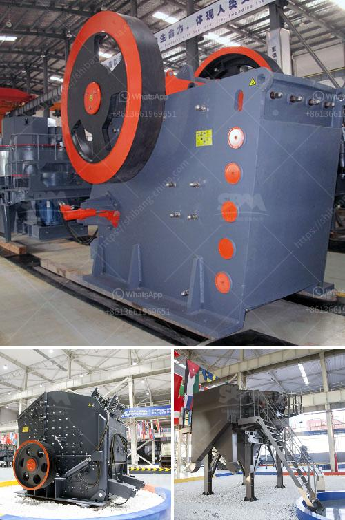

<h3>diesel engines grinding mills south africa</h3>
South Africa, with its vast agricultural and industrial sectors, heavily relies on diesel engines to power various machinery, including grinding mills. These mills are indispensable tools used in the processing of agricultural products, such as grains, maize, and sugar cane, as well as minerals and construction materials. Diesel engines are chosen for their durability, energy efficiency, and ability to deliver consistent power, making them the preferred choice for grinding mills in the country.

One of the primary reasons diesel engines are favored is their versatility. These engines can be easily adapted to power different types and sizes of grinding mills, allowing farmers and industrial workers to choose the mill that best suits their specific needs. Whether it's a small-scale mill for household use or a large-scale industrial mill, diesel engines can deliver the required power, ensuring smooth and efficient grinding operations.

Furthermore, diesel engines provide a reliable source of power, even in remote areas where access to electricity may be limited or unreliable. With a diesel engine, farmers and industrial workers can set up their grinding mills virtually anywhere without the need for a steady electrical supply. This makes it possible for rural communities to process their agricultural crops on-site, minimizing transportation costs and delays. It also enables small-scale farmers to generate additional income by offering their grinding services to neighboring communities.

In terms of energy efficiency, diesel engines are known for their fuel economy. Modern diesel engine technology has witnessed significant advancements, resulting in engines that deliver higher power with lower fuel consumption. This is particularly important in a country like South Africa, where fuel costs may be a significant expense for farmers and industrial operators. By reducing fuel consumption, diesel engines help to lower operational costs and make grinding mills a more sustainable option economically.

Another advantage of diesel engines is their durability and ruggedness. South Africa's agricultural and industrial sectors often operate in harsh conditions, including dusty environments and extreme temperatures. Diesel engines are designed to withstand these challenging conditions, offering a reliable and long-lasting power source for grinding mills. With proper maintenance and care, diesel engines can provide decades of service, contributing to the productivity and efficiency of agricultural and industrial operations across the country.

The demand for grinding mills powered by diesel engines remains high in South Africa due to the country's reliance on agriculture and mining. Grinding mills play a crucial role in transforming raw materials into finished products, such as flour, animal feed, and construction materials. Without efficient grinding mills, the production of these essential goods would be greatly hindered, affecting both food security and economic growth.

In conclusion, diesel engines are an integral part of grinding mills in South Africa, providing reliable power for agricultural and industrial purposes. Their versatility, energy efficiency, and durability make them the ideal choice for powering grinding mills of various sizes and scales. Diesel engines enable farmers and industrial workers to process agricultural and mining products effectively, thereby contributing to the growth and development of South Africa's economy.
<h3>Contact us</h3><ul><li><strong>Whatsapp:&nbsp;<a href="https://wa.me/8613661969651">+8613661969651</a></strong></li><li><a href="https://swt.shibang-china.com/?git&amp;zhl&amp;diesel engines grinding mills south africa"><strong>Online Service(chat now)</strong></a></li></ul><h3>Related</h3><ul><li><a href='types of diesel hammer mills in zimbabwe.md'>types of diesel hammer mills in zimbabwe</a></li><li><a href='harga stone cruser bekas dijual.md'>harga stone cruser bekas dijual</a></li><li><a href='calculate grinding ball diameter for ball mill.md'>calculate grinding ball diameter for ball mill</a></li><li><a href='micro grinding machine.md'>micro grinding machine</a></li><li><a href='rolling ball mills manufacturer.md'>rolling ball mills manufacturer</a></li></ul>