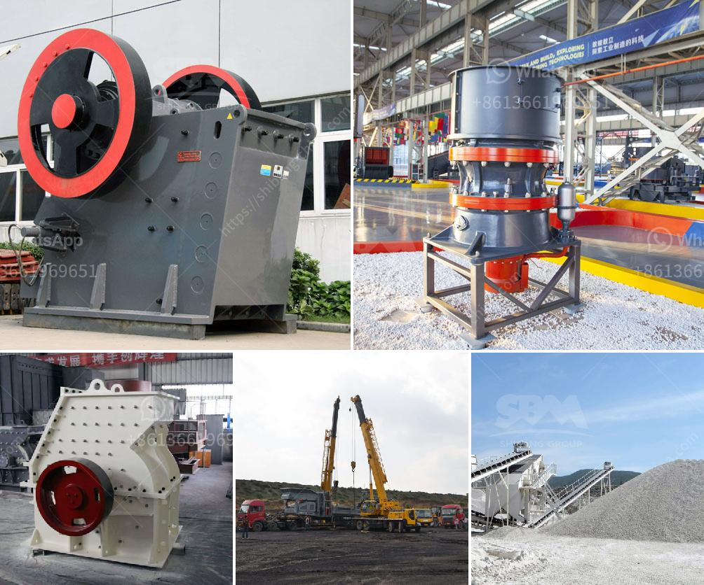

<h3>diesel grinding mills musina south africa</h3>
Diesel grinding mills have been in existence for several years in the agricultural sector. They have been used to grind various crops and produce high-quality flour and other grain-based products. In Musina, South Africa, diesel grinding mills are in high demand due to their efficiency and ease of use.

Musina is a small town located near the Zimbabwean border in the Limpopo province of South Africa. It is known for its rich agricultural industry and fertile soils, making it an ideal location for farming activities. Farmers in this region heavily rely on diesel grinding mills to process their crops and produce essential food items.

One of the main advantages of diesel grinding mills is their ability to function reliably even in areas with limited or no access to electricity. This is crucial in Musina, as some rural areas may not have a constant power supply. Diesel grinding mills are powered by diesel engines, enabling farmers to grind their crops irrespective of the power situation.

These mills are also highly efficient, ensuring that the grinding process is completed quickly. This is beneficial for farmers, as they can process their crops in a shorter period, making it possible to meet market demands more efficiently. Additionally, diesel grinding mills are durable and require minimal maintenance, making them a cost-effective solution for farmers in Musina.

By utilizing diesel grinding mills, farmers in Musina can process a variety of crops, including maize, wheat, sorghum, and millet. These crops are essential staples in the South African diet and grinding them into flour allows for the production of various food items such as bread, porridge, and other grain-based products.

In conclusion, diesel grinding mills have become an integral part of the agricultural sector in Musina, South Africa. These mills offer reliability, efficiency, and ease of use, making them highly sought after by farmers. With their ability to process a variety of crops, diesel grinding mills play a crucial role in ensuring food security in the region.
<h3>Contact us</h3><ul><li><strong>Whatsapp:&nbsp;<a href="https://wa.me/8613661969651">+8613661969651</a></strong></li><li><a href="https://swt.shibang-china.com/?git&amp;zhl&amp;diesel grinding mills musina south africa"><strong>Online Service(chat now)</strong></a></li></ul><h3>Related</h3><ul><li><a href='impact crusher for sale in kenya.md'>impact crusher for sale in kenya</a></li><li><a href='ball mill media suppliers.md'>ball mill media suppliers</a></li><li><a href='size to a jaw crusher and cone crusher.md'>size to a jaw crusher and cone crusher</a></li><li><a href='4 raymond roller mill.md'>4 raymond roller mill</a></li><li><a href='logo of stone crusher.md'>logo of stone crusher</a></li></ul>