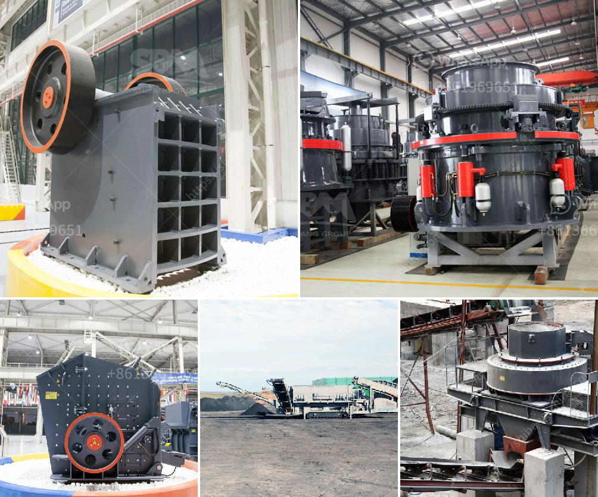

<h3>difference betweren jaw crusher and impact crusher</h3>
Crushing equipment is extensively used in the mining and construction industry for crushing different raw materials. Usually, the mining and construction applications require large rocks and ores to be crushed for further operation. There are different crushing machines available on the market, each with its own specific capabilities to process the required materials effectively. Jaw crushers and impact crushers are two commonly used crushing equipment options, but there are key differences between them that should be considered when making a choice.

The jaw crusher mainly consists of a fixed jaw plate and a moving jaw plate. The impact crusher is composed of a rotor, a hammer head, a plate hammer, a frame, a counterattack liner, a rotor shaft, and a locking block.

Jaw crushers are mainly used in mining, building materials, and infrastructure sectors. Impact crushers are suitable for materials that are coarse, medium, and fine, such as granite, limestone, and concrete, etc.

Jaw crushers have a maximum feeding size of 500-800mm, while the impact crushers have a maximum feeding size of 300-500mm.

Jaw crushers have a maximum output size of 0-30mm and the discharge size can be adjusted within the range of 80-180mm. The impact crushers have a maximum output size of 20-30mm and the discharge size can be adjusted within the range of 0-50mm.

The jaw crusher requires a power supply of 220-240V and can be supplied with either single-phase or three-phase power while the impact crusher needs a power supply of 360-600V and requires three-phase power.

Jaw crushers produce less noise compared to impact crushers due to their different technical characteristics. However, both crushers generate a considerable amount of noise during operation, which can be reduced using rubber damping.

Jaw crushers require regular maintenance to ensure their efficient operation. This includes regular lubrication of the bearing parts, cleaning and tightening of the belt, and timely replacement of worn-out parts. Impact crushers also require regular maintenance, including inspection and replacement of wear parts such as blow bars or liners.

The cost of jaw crushers is relatively higher than impact crushers. However, the initial investment cost of the impact crusher is higher than that of a jaw crusher.

In summary, the choice between jaw crushers and impact crushers ultimately depends on the application and the desired product size. Jaw crushers are more suited for applications where the primary objective is crushing large rocks into smaller particles. On the other hand, impact crushers are generally used for crushing materials with higher hardness and finer output requirements.
<h3>Contact us</h3><ul><li><strong>Whatsapp:&nbsp;<a href="https://wa.me/8613661969651">+8613661969651</a></strong></li><li><a href="https://swt.shibang-china.com/?git&amp;zhl&amp;difference betweren jaw crusher and impact crusher"><strong>Online Service(chat now)</strong></a></li></ul><h3>Related</h3><ul><li><a href='famous stone cone crusher for mining industry.md'>famous stone cone crusher for mining industry</a></li><li><a href='iron ore processing plant for sale.md'>iron ore processing plant for sale</a></li><li><a href='vibrations roller mills.md'>vibrations roller mills</a></li><li><a href='grinding mill plant cost.md'>grinding mill plant cost</a></li><li><a href='quartz crusher manufacturing process.md'>quartz crusher manufacturing process</a></li></ul>