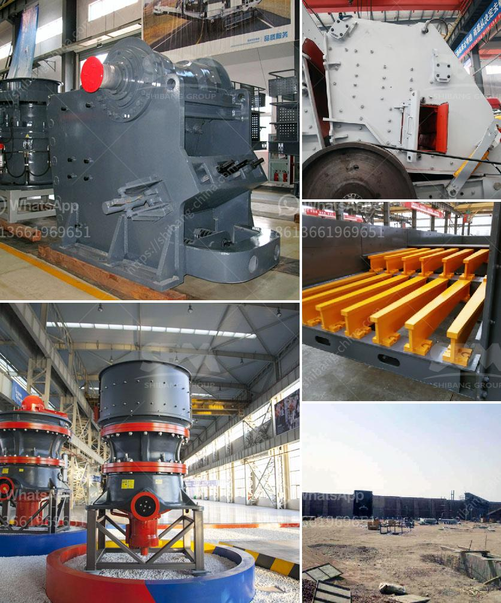

<h3>different crushed stones in nigeria</h3>
Nigeria, a country located in West Africa, is rich in natural resources including various stones and minerals. One of the key resources found in Nigeria is crushed stones. The stones can be used for construction purposes, as road fill, or as decorative pieces. This article will explore some of the different types of crushed stones found in Nigeria.

Granite is one of the most common crushed stones in Nigeria. It is a rock formed from the cooling of magma deep within the earth's crust. Granite is a very hard and durable stone, making it a preferred choice for construction purposes. It is commonly used as a building material for houses, bridges, and roads. The strength and aesthetic appeal of granite make it a popular choice for countertops, flooring, and wall cladding as well.

Limestone is another popular crushed stone found in Nigeria. It is a sedimentary rock composed mainly of calcium carbonate. Limestone is used in many construction projects due to its versatility. It can be crushed into various sizes and used as a base material for roads, driveways, and parking lots. It is also frequently used as an aggregate in concrete production. Limestone can be found in many parts of Nigeria, particularly in the southwestern region.

Marble is a beautiful and luxurious crushed stone found in Nigeria. It is formed from limestone that undergoes a metamorphic process. Marble has been used for centuries as a decorative stone in buildings, sculptures, and monuments. Its unique veining and color variations make it highly sought after for its aesthetic appeal. In Nigeria, marble is mostly found in the northern parts of the country, such as Kogi, Niger, and Kwara states.

Crushed stones such as gravel and quartzite are also abundant in Nigeria. Gravel is a loose aggregation of small, round stones or pebbles. It is commonly used in the construction industry for making concrete, road base, and drainage systems. Quartzite, on the other hand, is a metamorphic rock formed from sandstone. It is very hard and durable, making it suitable for use in high-traffic areas and outdoor spaces.

In conclusion, Nigeria is blessed with a variety of crushed stones that have various applications in construction and decorative projects. Granite, limestone, marble, gravel, and quartzite are just some of the different types of crushed stones found in Nigeria. Each of these stones has its own unique properties and uses. Whether it is for building houses, constructing roads, or beautifying indoor and outdoor spaces, the abundance of crushed stones in Nigeria provides plenty of options for both practical and aesthetic purposes.
<h3>Contact us</h3><ul><li><strong>Whatsapp:&nbsp;<a href="https://wa.me/8613661969651">+8613661969651</a></strong></li><li><a href="https://swt.shibang-china.com/?git&amp;zhl&amp;different crushed stones in nigeria"><strong>Online Service(chat now)</strong></a></li></ul><h3>Related</h3><ul><li><a href='grinding mill price in.md'>grinding mill price in</a></li><li><a href='quarry crusher machines italy.md'>quarry crusher machines italy</a></li><li><a href='small gold ore crusher grinder.md'>small gold ore crusher grinder</a></li><li><a href='want mobile crusher on rent pune india.md'>want mobile crusher on rent pune india</a></li><li><a href='gravel crusher for sale.md'>gravel crusher for sale</a></li></ul>