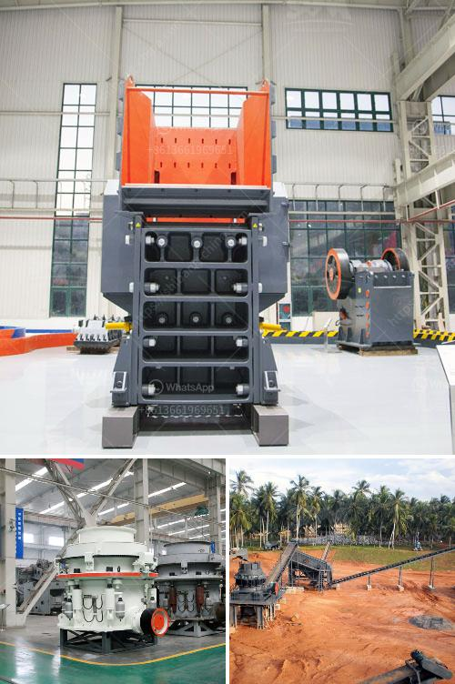

<h3>differnce between raw mill and ball mill</h3>
The raw mill and ball mill are two different types of grinding equipment in the cement industry. In the cement industry, the raw mill is used to grind raw materials into suitable particle size for the next stage of cement production. The ball mill is used to grind raw materials into fine powder, so that raw meal can be burned efficiently in the rotary kiln.

The raw mill plays an important role in the production process of cement. It grinds the raw materials into proper particle size, ensuring high-quality cement. The raw mill typically consists of a rotating plate that contains heavy steel balls, which collide with the raw materials to grind them into fine powder. The size of the raw mill can vary depending upon the capacity of the cement plant.

On the other hand, the ball mill is used to grind raw materials into fine powder. The ball mill consists of a cylindrical drum, sometimes tapered at one end, and usually has a charge of steel balls ranging in size up to 125mm for larger mills. Product size can be as small as 0.005mm, but product size is dependant upon the time the charge spends in the grinding zone and therefore the reduction rate is a function of the throughput.

The main difference between the raw mill and ball mill is the grinding materials. In the raw mill, the grinding material is discharged through a hollow trunnion-like cylinder with a grate hole at the discharge end. The grinding materials are continuously discharged, moving towards the discharge end.

In the ball mill, the grinding materials are discharged through a grate plate at the end of the shell. As the size reduction process is completed, the discharge end is equipped with a grid plate to filter out the qualified materials. The unqualified materials are then returned to the mill for further grinding.

Another difference is the grinding media used. The steel balls in the raw mill are usually forged grinding balls, which are high in wear resistance and low in breakage rate. However, the steel balls in the ball mill are different from those in the raw mill. In the ball mill, they are made of chrome steel. They are also referred to as cast iron balls.

The main difference between them is the power consumption. Raw mill is designed for energy-saving and has a strong material adaptability, especially suitable for large-scale building materials, metallurgy, mines, highways, bridges, chemical and other industries. Ball mill is a type of grinder machine which uses steel ball as grinding medium, can crush and grind the materials to 35 mesh or finer, adopted in open or close circuit. The feed materials can be dry or wet, they are broken by the force of impact and attrition that created by the different sized balls. 

In conclusion, the raw mill and ball mill are both important grinding equipment in the cement industry. They play different roles in the cement manufacturing process. Raw mill is mainly used for grinding raw materials into suitable particle size for the next step of cement production. Ball mill is used to grind raw materials into fine powder, ensuring high-quality cement production. The power consumption of raw mill is higher than that of the ball mill due to the large grinding materials and high-speed impact.
<h3>Contact us</h3><ul><li><strong>Whatsapp:&nbsp;<a href="https://wa.me/8613661969651">+8613661969651</a></strong></li><li><a href="https://swt.shibang-china.com/?git&amp;zhl&amp;differnce between raw mill and ball mill"><strong>Online Service(chat now)</strong></a></li></ul><h3>Related</h3><ul><li><a href='plamnta mobile stone crusher.md'>plamnta mobile stone crusher</a></li><li><a href='stone crusher plant for sale philippines.md'>stone crusher plant for sale philippines</a></li><li><a href='used stone crushing equipment in assam.md'>used stone crushing equipment in assam</a></li><li><a href='pioneer ve rock crusher.md'>pioneer ve rock crusher</a></li><li><a href='stone crusher machine plant for sale in pakistan.md'>stone crusher machine plant for sale in pakistan</a></li></ul>