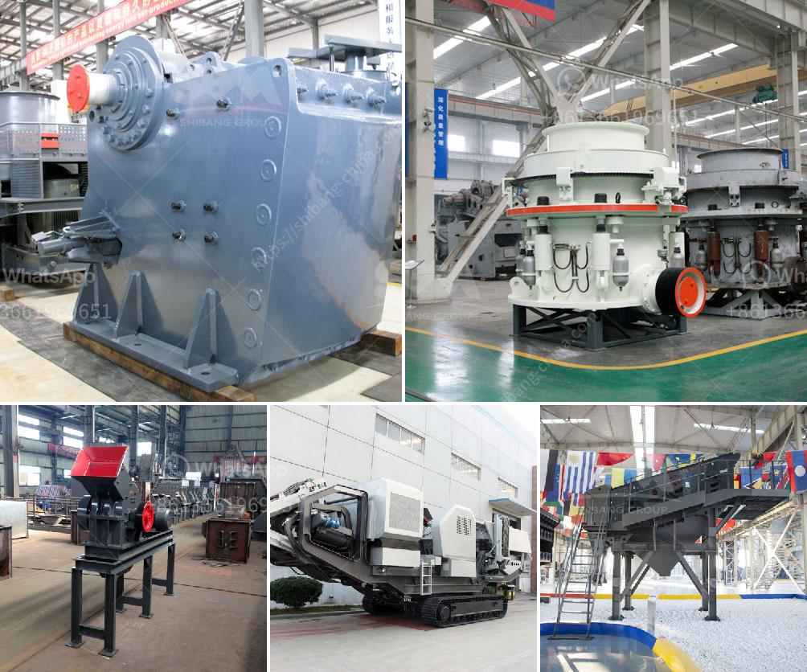

<h3>dolomite beneficiation process</h3>
Dolomite is a mineral composed of calcium magnesium carbonate. It is a common sedimentary rock-forming mineral that can be found in massive beds, several hundred feet thick. Dolomite is considered to be a carbonate mineral, meaning that it contains carbonates (CO3) in its crystal structure. It is widely used in various industries, including agriculture, construction, and the steel industry.

Dolomite beneficiation is the process of purifying raw dolomite before it is used for various applications. It involves several different stages that work together to remove impurities and increase the concentration of calcium carbonate in the dolomite ore. This process not only improves the quality of the ore but also enhances its value and makes it suitable for different end uses.

The first stage of dolomite beneficiation is crushing. The raw dolomite ore is crushed into small particles, typically less than 25mm in diameter. These small particles are then fed into a grinding mill, where they are ground into a fine powder. The grinding process helps to liberate the valuable minerals from the gangue (unwanted material) and increases their surface area, making them more accessible for subsequent processing.

After grinding, the dolomite ore undergoes a flotation process. Flotation is a separation technique that is based on the difference in the surface properties of minerals. In the case of dolomite beneficiation, the ore is mixed with water and a collector chemical, which selectively attaches to valuable minerals while repelling gangue minerals. Air bubbles are then introduced into the mixture, which carry the valuable minerals to the surface, forming a froth. The froth is then skimmed off, and the valuable minerals are collected and dried.

The next stage in the dolomite beneficiation process is magnetic separation. Magnetic separation is a method that uses magnets to separate magnetic minerals from non-magnetic ones. In this case, a magnetic field is applied to the dolomite ore, causing the magnetic minerals to be attracted to the magnets while non-magnetic minerals remain unaffected. The magnetic minerals are then collected and further processed.

The final stage of dolomite beneficiation is calcination. Calcination is a thermal treatment process that involves heating the dolomite ore at high temperatures, typically around 1000-1200 degrees Celsius. This process removes carbon dioxide from the dolomite, resulting in the formation of calcium oxide (lime) and magnesium oxide. Calcination improves the chemical composition of the dolomite ore and enhances its reactivity, making it suitable for various applications.

Overall, dolomite beneficiation is a complex process that requires careful planning and execution. Each stage plays a crucial role in transforming raw dolomite ore into a valuable product. By removing impurities and increasing the concentration of calcium carbonate, the beneficiation process enhances the quality and value of dolomite, making it suitable for various industrial applications. With advancements in technology and ore characterization, the efficiency of dolomite beneficiation processes continues to improve, leading to more sustainable and cost-effective operations in the future.
<h3>Contact us</h3><ul><li><strong>Whatsapp:&nbsp;<a href="https://wa.me/8613661969651">+8613661969651</a></strong></li><li><a href="https://swt.shibang-china.com/?git&amp;zhl&amp;dolomite beneficiation process"><strong>Online Service(chat now)</strong></a></li></ul><h3>Related</h3><ul><li><a href='flow chart gypsum production.md'>flow chart gypsum production</a></li><li><a href='milling and grinding machine.md'>milling and grinding machine</a></li><li><a href='stone crusher machines from denmark.md'>stone crusher machines from denmark</a></li><li><a href='slag powder machine.md'>slag powder machine</a></li><li><a href='used crusher for sale kenya.md'>used crusher for sale kenya</a></li></ul>